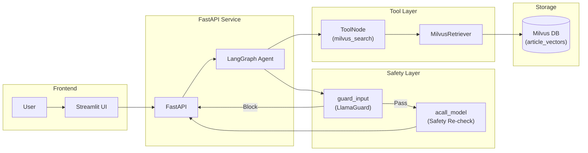
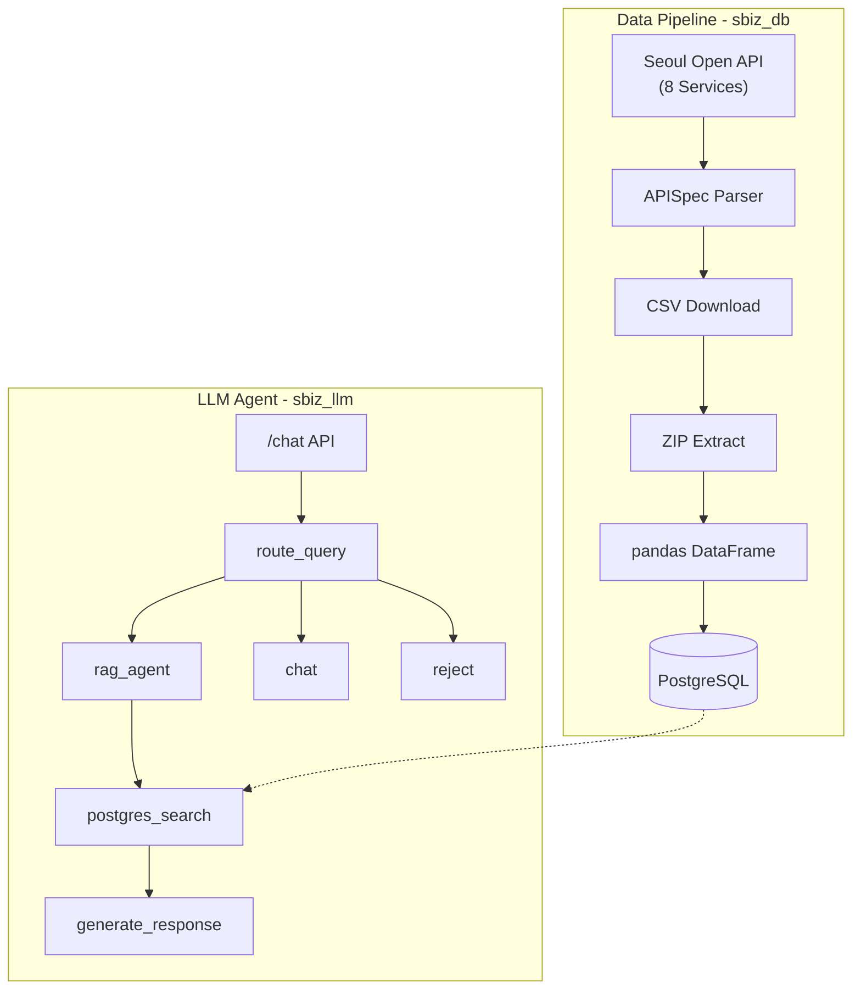
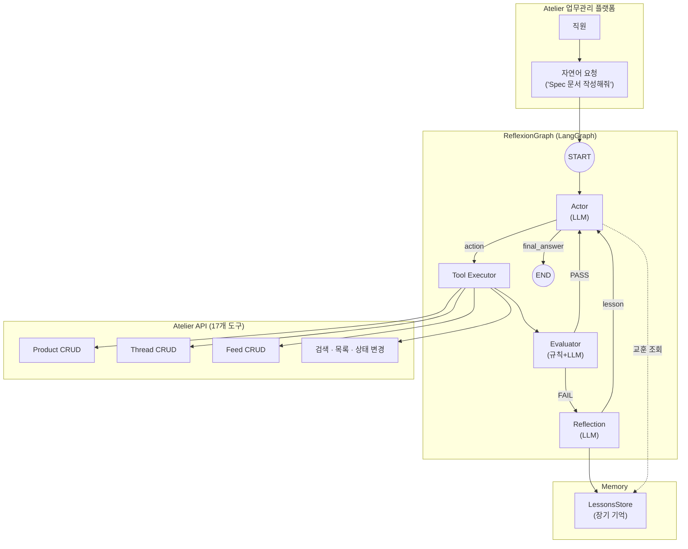
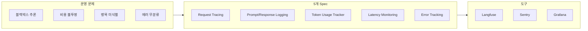

# 포트폴리오

## 소개

> **김선준** | UNIST 산업공학과 석사 (2023)
> 벡터 검색과 LLM Agent 기반 서비스를 만드는 백엔드/AI 엔지니어

[](https://github.com/SJayKim)
[](mailto:cyon13022@gmail.com)
[](https://wikidocs.net/book/19070)

석사 때 추천 시스템을 연구했고, 졸업 후에는 그 경험으로 벡터 DB 구축, vLLM 서빙, RAG, Agent 시스템 프로젝트에 참여하며 경험을 쌓음.

---

## 학위 논문

**Personal recommender system via convolutional autoencoder with conditioning augmentation**

Convolutional Autoencoder로 사용자 선호를 잠재 벡터로 표현하고, 벡터 유사도로 아이템을 추천하는 연구. 이때 다룬 임베딩-검색 구조가 이후 pgvector, Milvus 프로젝트에 그대로 이어짐.

Kim, Sunjun (2023) | UNIST 산업공학과 석사
[논문 링크](https://apac-tc.hosted.exlibrisgroup.com/primo-explore/fulldisplay?docid=82UNIST_INST21228494070002596&vid=82UNIST&search_scope=everything&tab=everything&lang=ko_KR&context=L)

---

## 기술 스택

| 분류 | 기술 |
|------|------|
| LLM Serving & Agent | vLLM, LangGraph, LangChain, MCP |
| ML/DL | scikit-learn, LightGBM, HuggingFace Transformers, Fine-tuning (BERT) |
| Vector DB & Embedding | Milvus, Pgvector, BGE-M3, BGE-Reranker |
| Backend & Infra | Python, FastAPI, PostgreSQL, Oracle |
| DevOps & Deploy | Docker, Docker Compose, NVIDIA Container Toolkit, Multi-stage Dockerfile |

---

## 프로젝트

### 1. Skylife 영화 추천 시스템 · Search

**소속**: AIO2O (4명 팀) | **역할**: AI 파트 담당 — 벡터 DB 설계, 추천 알고리즘 개발

장르·배우 같은 메타 필터만으로 추천하면 비슷한 결과만 나옴. 영화 메타 정보(장르, 내용 요약, 감독, 배우)를 임베딩해서 PostgreSQL + pgvector에 넣고, 추천을 2단계로 나눔 — 메타 필터링으로 후보를 줄인 뒤, 영화 설명 벡터 유사도로 순위를 매기는 방식. 기존 메타 필터 대비 추천 다양성이 개선되어, 같은 조건에서도 유사하되 새로운 영화가 추천됨.
Docker 기반으로 API 서버를 컨테이너화하여 배포. Dockerfile로 개발/스테이징/운영 환경을 동일하게 유지함.

**기술 스택**: Python, PostgreSQL, pgvector, Embedding Models, Docker

---

### 2. 부산관광공사 여행 스케줄링 챗봇 · Search · Service

**소속**: AIO2O (5명 팀) | **역할**: AI 파트 리드 — 벡터 DB 구축, 추천 알고리즘, 챗봇 개발

기존에는 사람이 직접 짜놓은 추천 코스만 제공할 수 있었고, "부산 / 1박 2일 / 맛집" 같은 고정 필터 수준이었음. "아이랑 갈 만한 조용한 곳" 같은 자연어 질의엔 대응이 안 됨.

관광공사 데이터(관광지 설명, 장소, 평점, 리뷰 등)를 활용해 벡터 DB를 구성함. 특히 관광지 설명과 후기를 적극적으로 활용 — 리뷰에서 긍정적 키워드, 부정적 키워드, 해시태그를 추출해 벡터 입력에 함께 반영함으로써 의미 기반 검색 품질을 높였음.

영화 추천에서 쓴 2단계 알고리즘을 여행 도메인에 맞게 바꿈. 메타 필터링(지역, 숙박 일수, 카테고리) → 벡터 유사도(여행지 설명, 후기 키워드, 해시태그를 포함한 통합 벡터). 추천 결과로 일정 구성까지 해줌. **현재 부산관광공사(Visit Busan)에서 상용 운영 중.**

**서비스 링크**: [Visit Busan](https://www.visitbusan.net/index.do?menuCd=DOM_000000203018000000)

Docker Compose로 API 서버와 벡터 DB를 컨테이너화하여 배포. 환경별 설정을 .env 파일로 분리하고, 배포 프로세스를 자동화함.

**기술 스택**: Python, Embedding Models, Vector DB, NLP, Docker Compose

---

### 3. vLLM 기반 텍스트 처리 API 서비스 · Serving

**소속**: Plantynet | **역할**: 단독 개발 — LLM 서빙 및 API 설계·개발·배포

기사 요약, 분류, 태깅을 각각 따로 처리하고 있었는데, 외부 API 호출 비용과 레이턴시가 쌓여서 자체 서빙이 필요해짐. vLLM LLMEngine을 FastAPI 프로세스 안에서 직접 구동하는 in-process 아키텍처로 외부 API 호출 비용 100% 절감, 평균 응답 시간 약 65% 단축. 토큰 레벨 연속 배칭으로 동시 요청 효율을 높이고 asyncio.Semaphore로 GPU 메모리 초과를 방지함.

**주요 기능**
- 기사 요약 (목표 길이 70~130% 범위 내 수렴 알고리즘)
- 긴 문서 축약 (Map-Refine: 불릿 추출 → 평문 변환)
- 주제 분류 및 분류체계(Taxonomy) 분석
- 키워드/태그 추출 (구조화된 출력 기반)
- Gradio UI (기획팀이 바로 테스트 가능)

**API Endpoints**
```
POST /summarize_article         - 기사 요약
POST /summarize_magazine        - 긴문서 축약 (Map-Refine)
POST /classify_topic_from_article    - 주제 분류
POST /classify_taxonomy_from_article - 분류체계 분석
POST /generate                  - 자유 대화
```

v0(기본 vLLM 서빙) / v1(LangGraph 에이전트 기반) 버전 관리로 기존 연동을 깨지 않으면서 점진 전환함. v1에서 LangGraph를 도입한 건 요약 길이 수렴처럼 조건 분기와 재시도가 필요한 작업이 늘었기 때문임. 요약 길이 수렴 성공률 약 92% 달성.

Docker + NVIDIA Container Toolkit 기반으로 GPU 서빙 컨테이너를 구성. Multi-stage Dockerfile로 빌드 의존성과 런타임을 분리해 이미지 크기를 최적화하고, Docker Compose로 서비스 기동·업데이트를 자동화함.

**기술 스택**: Python, FastAPI, vLLM, LangGraph, PyTorch, Gradio, Docker, NVIDIA Container Toolkit

---

### 4. Milvus 기반 Agentic RAG 시스템 · Search · Safety

**소속**: Plantynet (AI 파트 2명) | **역할**: 검색 엔진/전처리/에이전트 전체 담당

플랜티넷 기존 서비스 Moazine은 다양한 잡지를 모아 볼 수 있는 매거진 플랫폼이었는데, 여기에 챗봇을 붙여 기사 검색·추천을 자연어로 할 수 있게 하자는 기획으로 시작된 프로젝트. 기존에는 키워드 매칭만 있어서 의미 기반 질문("여름에 읽기 좋은 글")에 대응이 안 됐음. 생성형 AI 응답의 안전성 검증도 없었음.

Dense 벡터(BGE-M3)와 BM25 Sparse를 합친 하이브리드 검색을 개발함. 도입 후 키워드 검색 대비 Top-5 Recall 약 35% 향상. BGE-Reranker-v2-M3로 재정렬하고, 검색된 청크 앞뒤 문맥을 자동으로 붙이는 컨텍스트 윈도우를 넣어서 문맥 잘림을 방지함. 매거진 추천에는 Milvus Group Search를 활용 — 해당 매거진에 속한 모든 청크와의 유사도를 계산한 뒤, 가장 높은 순으로 매거진을 추천하는 방식으로 구현함.

전처리에서 전체 약 15만 건 청크 중 100자 이하·특수문자·KoNLPy 토큰 검증 실패 건을 걸러내 약 1.8만 건(12%) 노이즈를 제거함.

**시스템 아키텍처**



에이전트 흐름은 Safety Guard → Reasoning → Tool Calling → Response 순서임. 입력/출력 모두 LlamaGuard가 검사함. SSE로 토큰 단위 스트리밍, Thread 기반 Checkpoint Store로 대화 이력 관리함.

Docker Compose로 Milvus(벡터 DB) + FastAPI(백엔드) + Streamlit(프론트엔드) 3-tier 구성을 단일 명령으로 배포. 서비스 간 네트워크를 Docker 내부 브릿지로 격리하고, 볼륨 마운트로 데이터 영속성을 보장함.

**코드 구조**
```
src/agents/
  rag_assistant.py    - RAG Agent 그래프 정의 (guard_input → model → tools)
  milvus_tool.py      - MilvusRetriever 래퍼
  tools.py            - milvus_search 도구 등록
  llama_guard.py      - 안전성 검증
  milvus_key_search/  - 검색 엔진 코어

app/
  rag_api.py          - FastAPI 검색 API
  rag_query.py        - 쿼리 처리
```

**기술 스택**: Python, LangGraph, LangChain, FastAPI, Milvus, Streamlit, BGE-M3, BGE-Reranker, MongoDB, PostgreSQL, Docker Compose

---

### 5. URL 기반 스미싱 탐지 시스템 · Security · ML · Pipeline

**소속**: Plantynet | **역할**: 단독 개발 — 기존 시스템 분석, 모델 선정·Fine-tuning, 동적 URL 파이프라인 설계·구현

기존 스미싱 탐지는 외부 스캐닝 API(Criminal IP)로 URL 메타데이터(dgaScore, domainDiff 등)를 수집한 뒤 Random Forest로 분류하는 구조였음. API 실패율 70%, 데이터 생존율 2.1%, 실환경(9:1) F1 28.79%로 운영에 한계가 있었음. 특히 단축 URL(bitly, 2ms.kr 등)은 Whois 정보가 없어서 domainDiff=0으로 처리되면서 대부분 오분류됨.

이 문제를 두 가지 접근으로 해결함 — **URL 텍스트 기반 딥러닝(URLBert)**과 **HTML 구조 기반 동적 URL 분석**.

**[접근 1] URLBert Fine-tuning**

외부 API 의존을 제거하기 위해 URL 텍스트 자체에서 패턴을 학습하는 방식을 택함. CrabInHoney/urlbert-tiny-v4(BERT 기반, 3.69M 파라미터, 14.8MB)를 선택한 이유는: ① URL 도메인 특화 사전학습, ② CPU만으로 학습·추론 가능(사내 GPU 미보유), ③ PhishBERT(영문 특화)·BERT-base(110M, 과도)보다 한국형 단축 URL에 적합.

| 항목 | 설정 |
|------|------|
| 학습 데이터 | 4,296건 (스미싱 2,148 + 정상 2,148, 1:1 균형) |
| 분할 | Train 80% (3,436건) / Eval 20% (860건) |
| 에포크 | 3 |
| 학습 시간 | 142초 (CPU) |

**모델 성능 비교 (1:1 균형 데이터):**

| 모델 | Accuracy | Precision | Recall | F1 |
|:---:|:---:|:---:|:---:|:---:|
| 기존 Random Forest | 51.54% | 51.18% | 66.96% | 58.02% |
| URLBert Zero-Shot | 58.31% | 65.19% | 35.66% | 46.10% |
| **URLBert Fine-Tuned** | **96.16%** | **97.60%** | **94.65%** | **96.10%** |

실환경(9:1 불균형)에서도 F1 95%+, Precision 97%+ 유지. 추론 속도 0.05ms/URL.

**[접근 2] HTML 구조 기반 동적 URL 탐지**

bitly/2ms.kr 같은 단축 URL은 원본 URL과 랜딩 페이지가 다름. HTTP 리다이렉트를 따라간 뒤 최종 랜딩 페이지의 HTML 구조를 분석하는 파이프라인을 구축함.

피싱 웹사이트 탐지 오픈소스에서 15개 피처를 포팅하고, 한국형 스미싱 특화 2개 피처(has_tel_input, has_kr_keyword)를 추가해 총 17개 HTML 피처를 설계함.

| 평가 방법 | Accuracy | Precision | Recall | F1 |
|:---:|:---:|:---:|:---:|:---:|
| 1:1 균형 | 96.51% | 97.62% | 95.35% | 96.47% |
| 9:1 불균형 | 98.36% | 95.00% | 88.37% | 91.57% |

**[접근 3] 파이프라인 오케스트레이션 + 모니터링 시스템**

메모리 기반 3단계 파이프라인(Oracle ETL → 모델 평가 → 이메일 알림) 오케스트레이션 설계. history.json에 최근 20회 실행 이력을 유지하면서 시계열 분석으로 이상을 감지함.

**모니터링 핵심 지표:**

| 모니터링 그룹 | 핵심 지표 | 임계값 |
|:---:|------|------|
| 시스템 건강 상태 | 실행 성공/실패율, 스텝별 소요 시간 | 크론잡 중단·병목 즉시 파악 |
| 데이터 수집 효율 | URL 처리량, API 실패 건수, 레이블 비율 변화 | ±5%p warning, ±15%p critical |
| AI 모델 성능 | F1·Accuracy 시계열 (최근 20회) | ±10%p warning, ±20%p critical |

**실증 사례**: 실제 운영 중 외부 API 전면 장애(수집 0건, 실패 586건, 실패율 100%)를 자동 감지. 기존에는 담당자가 로그를 수동 확인하기 전까지 인지할 수 없었던 장애.

**기술 스택**: Python, HuggingFace Transformers, scikit-learn, LightGBM, BeautifulSoup4, pandas, Oracle, PostgreSQL

---

### 6. 서울 상권분석 시스템 (Side Project) · Pipeline · Agent

**역할**: 1인 개발 — DB 스키마 설계, LLM 구현, 프롬프트 설계, 백엔드/프론트엔드/배포 전체 개발

서울시 상권 데이터가 공개되어 있긴 한데, API 8개에 테이블 9개가 흩어져 있어서 SQL 모르면 사실상 못 씀. "강남역 카페 매출 추이"를 자연어로 물어보면 알아서 찾아주는 게 필요하다 생각해서, 수집 파이프라인(sbiz_db)과 분석 에이전트(sbiz_llm)를 따로 만들어서 구현함.

**시스템 아키텍처**



수집 쪽은 서울 Open API 8개 서비스의 HTML을 APISpec 클래스로 파싱해 스키마를 자동 추출하고, pandas 컬럼 매핑(한글 → 영문) 후 PK 기반 UPSERT로 PostgreSQL에 삽입함. CLI(--sync-all, --validate 등)와 크론잡 지원함.

분석 에이전트는 LangGraph 기반 쿼리 라우터(rag/chat/reject 분기)로 돌아감. 상권 질문이면 Tool Calling으로 9개 테이블(추정 매출, 점포, 유동 인구, 상주 인구, 직장 인구, 임대료, 상권 변화 지표, 집객 시설 등)에 PostgreSQL 동적 검색을 날림. Tool Input은 Pydantic BaseModel, DB 접근은 asyncpg 비동기임.

**코드 구조**
```
sbiz_db/
  data_sync.py        - 메인 동기화 서비스
  api_spec.py         - 서울 API 스펙 파서
  init_db/01_schema.sql - DB 스키마

sbiz_llm/src/
  agents/sbiz_agent.py          - LangGraph Agent
  agents/tools/postgres_search.py - PostgreSQL 검색 도구
  agents/subagents/query_router.py - 쿼리 라우팅
  core/settings.py              - Pydantic Settings
  core/prompts.py               - 시스템 프롬프트
  service/service.py            - FastAPI 서비스
```

**기술 스택**: Python, LangGraph, FastAPI, PostgreSQL, asyncpg, pandas, BeautifulSoup4, psycopg2, Docker Compose

---

Docker Compose로 PostgreSQL + FastAPI(백엔드) + Frontend를 통합 배포. DB 초기화 스크립트를 Docker entrypoint에 포함시켜 환경 구축을 자동화함.
수집부터 자연어 분석까지 전부 혼자 만든 프로젝트임.

---

### 7. ReAct + Reflexion 자기 개선형 AI 에이전트 · Agent · Platform

**소속**: Plantynet | **역할**: 단독 개발 — Agent 로직 설계·구현·배포

Jira와 유사한 업무관리 플랫폼(Atelier)에 연동되는 AI 에이전트. 직원들이 자연어로 업무 관련 요청("이번 스프린트 피드 정리해줘", "신규 기능 Spec 문서 작성해줘" 등)을 하면, 에이전트가 플랫폼 API를 호출해 직접 처리함. 단순 조회·수정·삭제뿐 아니라, 개발 관련 Spec 문서 작성, 업무 요약, 일정 조정 같은 복합적인 업무 보조도 수행하는 공간임.

**니즈 조사 — 개발자·기획자 설문 결과**

개발 전 개발자와 기획자를 대상으로 업무 현장의 팁 포인트를 설문하고, 그 결과를 에이전트 기능 우선순위에 반영함.

| 순위 | 니즈 | 현장 문제 | 에이전트 반영 |
|------|------|------|------|
| 1 | **상호 이해를 위한 기능·요구 정의서** | 기획자의 요청 의도와 개발자의 이해 범위가 달라 잘못된 방향으로 개발이 진행되는 문제가 빈번했음 | 에이전트가 요청 내용을 기반으로 Spec 문서를 자동 생성해 양쪽이 같은 정의를 보고 합의할 수 있도록 구현 |
| 2 | **프로젝트 히스토리 관리** | 구두 요청이 잦아 결정 사항이 기록으로 남지 않고, 서로 이해하는 개발 범위·기능 정의가 엇갈리는 문제가 반복됨 | Feed 기반으로 업무 요청·변경·논의 이력을 자동 기록하고 스레드별로 추적 가능하게 구현 |

이 설문 결과를 바탕으로 **Spec 문서 자동 생성**과 **Feed 기반 업무 이력 추적**을 핵심 우선순위 기능으로 설계함.

**플랫폼 컨텍스트 — 무엇을 자동화하는가**

Atelier 플랫폼은 Product → Thread → Feed 3계층 구조로 업무를 관리함. 에이전트는 이 계층 전체에 대해 자연어 명령으로 CRUD 및 유틸리티 작업을 수행함.

| 계층 | 설명 | 에이전트가 수행하는 작업 예시 |
|------|------|------|
| **Product** | 프로젝트 단위 | 프로덕트 생성·조회·목록, 하위 스레드 일괄 조회 |
| **Thread** | 업무 단위 (제목, 목표, 시작일~종료일) | 스레드 생성·수정·삭제, 기간 변경, 목표 업데이트 |
| **Feed** | 활동 기록 (본문, 카테고리, 코멘트) | 피드 작성·수정·삭제, 카테고리 분류, 코멘트 추가 |

**에이전트 주요 기능**
- **업무 요청 처리**: "다음 주 스프린트 스레드 만들어줘", "이 피드 내용 수정해줘" 등 자연어 명령을 Tool Calling으로 즉시 실행
- **Spec 문서 작성**: 개발 기획서, 기능 명세, API 설계 문서 등을 Feed로 작성. 기존 스레드의 맥락을 참고해 구조화된 문서를 자동 생성
- **업무 현황 요약**: 특정 프로덕트나 스레드의 피드를 조회해서 진행 상황을 요약·정리
- **일정 관리**: 스레드의 시작일·종료일 조정, 마감 임박 태스크 알림 등
- **복합 태스크**: 여러 도구를 조합하는 multi-step 작업 (예: 프로덕트 조회 → 스레드 생성 → Spec 피드 작성을 한 번의 요청으로 처리)

에이전트가 이런 작업을 수행할 때 Tool Calling에 실패하면 같은 실수를 반복하거나 멈춰버리는 게 문제였음. 사람이라면 왜 틀렸는지 생각하고 다음엔 다르게 시도하는데, 그 로직을 그대로 agent로 구현함. ReAct(Yao et al., 2023) 논문의 Reasoning + Acting 루프를 기반으로 하되, 실패 시 자기 반성(Reflexion)까지 추가한 구조임.

**시스템 아키텍처**



**에이전트 프로세스 상세**

1. **입력 해석**: 직원의 자연어 요청이 들어오면 Actor가 ReAct 루프를 시작. Thought 단계에서 요청을 분석하고, 필요한 도구와 실행 순서를 계획함.
2. **도구 실행**: Action 단계에서 17개 도구 중 적절한 것을 선택해 Tool Executor가 실행. 복합 태스크는 여러 도구를 순차적으로 호출 (예: get_product → create_thread → create_feed).
3. **결과 평가**: Evaluator가 2단계로 평가함 — ① 에러 키워드 규칙 필터(HTTP 에러, 필수 필드 누락 등 즉시 판별), ② LLM 정밀 판단(결과가 요청 의도에 부합하는지 검증).
4. **자기 반성 (Reflexion)**: FAIL 판정 시 Reflection 노드가 실패 원인을 분석하고, problem/solution 쌍으로 장기 기억(LessonsStore)에 저장. 예: "thread 생성 시 endDate 누락 → startDate가 있으면 endDate도 반드시 포함" 같은 교훈.
5. **교훈 재활용**: 다음에 비슷한 상황이 오면 Actor가 LessonsStore에서 관련 교훈을 꺼내 프롬프트에 포함시킴. 같은 실패가 3회 이상 반복되면 Early Stopping으로 중단.

**17개 도구 (Tool Calling)**
```
Product:  create / get / list
Thread:   create / get / update / delete / list_by_product
Feed:     create / get / update / delete / list_by_thread
Utility:  search / get_current_time / get_status / update_status / bulk_create
```

LLM은 Gemini, OpenAI, Anthropic 사이에서 YAML 설정만 바꾸면 전환 가능함.

**설문 기반 핵심 문제 해결 성과**
- **Spec 문서 자동 생성**: 요청 내용을 기반으로 기능 명세·API 설계 문서를 자동 생성해, 기획자와 개발자가 같은 정의를 보고 합의할 수 있는 구조를 구현. 설문 1순위 불만(기획-개발 간 이해 차이) 해결.
- **Feed 기반 히스토리 추적**: 업무 요청·변경·논의 이력을 Feed로 자동 기록하고 스레드별로 추적 가능하게 구현. 설문 2순위 불만(구두 요청으로 인한 히스토리 유실) 해결.
- **자기 개선 구조 효과**: 실패를 기록하고 재활용하는 구조가 돌아가면서, 동일 유형 작업의 평균 재시도 횟수가 약 55% 감소함.

Docker Compose로 Agent 서비스와 MCP Server를 분리 배포. 각 컨테이너의 환경 변수와 볼륨을 독립 관리하여 Agent만 재배포해도 MCP 연결이 유지되는 구조로 구현함.

**LLMOps Observability 설계**

LLM 기반 Agent는 비결정적(non-deterministic) 특성으로 운영 단계에서 문제가 발생함. 이를 해결하기 위해 5개 Observability Spec을 설계함.



| Spec | 핵심 질문 | 설계 내용 |
|------|-----------|----------|
| A. Request Tracing | "이 요청이 어떤 경로로 처리되었는가?" | 7개 노드를 trace_id로 연결, 조건부 엣지 흐름 기록 |
| B. Prompt/Response Logging | "어떤 프롬프트로 어떤 응답이 나왔는가?" | LLM 호출 입력/출력 구조화 저장, A/B 테스트·Hallucination 탐지 근거 |
| C. Token Usage Tracker | "토큰이 어디서 얼마나 소모되는가?" | 노드별·모델별 소비 집계 → 비용 주범 특정 |
| D. Latency Monitoring | "어느 단계가 느린가?" | TTFT, node_duration_ms 측정, 병목 식별 |
| E. Error Tracking | "어떤 에러가 왜 발생하는가?" | 5개 카테고리 + 20여 개 세부 유형 분류 |

**도구 선정:**
- **Langfuse**: LLM 특화 오픈소스, self-host 가능, A~D 일괄 커버
- **Sentry**: 에러 분류·그룹핑·알림 특화
- **Grafana + Prometheus**: 커스텀 메트릭 집계, 알림 규칙 유연성

**기술 스택**: Python, LangGraph, LangChain, Google Gemini, OpenAI, Anthropic, Langfuse, Sentry, Grafana, Pydantic, YAML, Docker Compose

---

## 연구 개발 자료

- [Notion 연구 개발 노트](https://www.notion.so/2f5736a271928061be4ac9554a9c670c?v=2f5736a2719280dfb9a4000c215b258e&p=2f5736a2719280d89a4ada3827ad5965&pm=s)
- [개발 연구자료 정리 저서 — 『Agentic AI: 스스로 진화하는 인공지능 에이전트 만들기』](https://wikidocs.net/book/19070)
  90일 기준 페이지뷰 9,234 · 방문자 8,785 · 평균 체류시간 12분 · 이탈률 1.0%

---

## 연락처

- 이메일: cyon13022@gmail.com
- GitHub: [github.com/SJayKim](https://github.com/SJayKim)
- Wikidocs 저서: [『Agentic AI: 스스로 진화하는 인공지능 에이전트 만들기』](https://wikidocs.net/book/19070)
