# 포트폴리오

## 소개

> **김선준** | UNIST 산업공학과 석사 (2023)
> 벡터 검색과 LLM Agent 기반 서비스를 만드는 백엔드/AI 엔지니어

[](https://github.com/SJayKim)
[](mailto:cyon13022@gmail.com)
[](https://wikidocs.net/book/19070)

석사 때 추천 시스템을 연구했고, 졸업 후에는 그 경험으로 벡터 DB 구축, vLLM 서빙, RAG, Agent 시스템 프로젝트에 참여하며 경험을 쌓음.

## 일하는 방식

기술 자체보다 현장의 문제와 그 해결이 만드는 가치를 먼저 봄. 그래서 각 프로젝트도 어떤 모델을 썼는지보다, 어떤 문제를 어떤 구조로 풀었는지 중심으로 정리함.

---

## 학위 논문

**Personal recommender system via convolutional autoencoder with conditioning augmentation**

Convolutional Autoencoder로 사용자 선호를 잠재 벡터로 표현하고, 벡터 유사도로 아이템을 추천하는 연구. 이때 다룬 임베딩-검색 구조가 이후 pgvector, Milvus 프로젝트에 그대로 이어짐.

Kim, Sunjun (2023) | UNIST 산업공학과 석사
[논문 링크](https://apac-tc.hosted.exlibrisgroup.com/primo-explore/fulldisplay?docid=82UNIST_INST21228494070002596&vid=82UNIST&search_scope=everything&tab=everything&lang=ko_KR&context=L)

---

## 기술 스택

| 분류 | 기술 |
|------|------|
| AI/LLM | vLLM, LangGraph, HuggingFace Transformers, Fine-tuning (BERT) |
| Search | Milvus, Pgvector, BGE-M3 |
| Backend | Python, FastAPI, PostgreSQL |
| Infra | Docker, Docker Compose |

---

## 프로젝트

### 1. ReAct + Reflexion 자기 개선형 AI 에이전트 · Agent · Platform

**소속**: Plantynet | **역할**: 3명 팀 (Front 1, Back 1, AI 1) AI Agent 로직 개발 담당 — Agent 로직 설계·구현·배포

사내 업무관리 플랫폼에 연동되는 AI 에이전트. 직원들이 자연어로 업무 관련 요청("Spec 문서 작성해줘", "이번 스프린트 정리해줘" 등)을 하면, 에이전트가 플랫폼 API를 호출해 직접 처리함.

**니즈 조사 — 개발자·기획자 설문 결과**

개발 전 개발자와 기획자를 대상으로 페인 포인트를 설문하고, 기능 우선순위에 반영함.

| 순위 | 현장 문제 | 에이전트 해결 |
|------|------|------|
| 1 | 기획자와 개발자 간 요구 정의가 엇갈려 잘못된 방향으로 개발이 진행됨 | Spec 문서 자동 생성으로 양쪽이 같은 정의를 보고 합의 |
| 2 | 구두 요청이 잦아 결정 사항이 기록으로 남지 않음 | 업무 요청·변경·논의 이력을 자동 기록하고 추적 가능하게 구현 |

**에이전트 주요 기능**: Spec 문서 자동 작성, 업무 현황 요약, 일정 관리, 업무 이력 추적. 프로젝트·업무·활동 3계층에 대해 17개 도구를 연결하고, 여러 도구를 조합하는 multi-step 작업도 처리함.

에이전트가 Tool Calling에 실패하면 같은 실수를 반복하거나 멈추는 게 문제였음. ReAct(Yao et al., 2023) 논문의 Reasoning + Acting 루프를 기반으로 하되, 실패 시 자기 반성(Reflexion)까지 추가한 구조로 해결함.

**시스템 아키텍처**

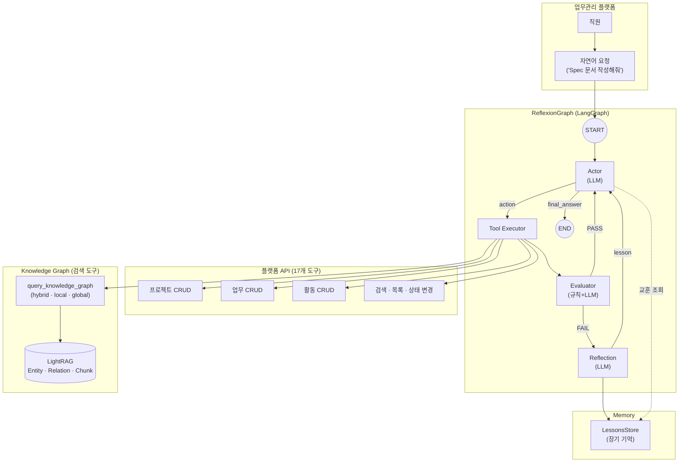

**에이전트 프로세스 상세**

1. **입력 해석**: 자연어 요청이 들어오면 Actor가 ReAct 루프를 시작. 요청을 분석하고 필요한 도구와 실행 순서를 계획함.
2. **도구 실행**: 17개 도구 중 적절한 것을 선택해 Tool Executor가 실행. 복합 태스크는 여러 도구를 순차 호출.
3. **결과 평가**: Evaluator가 2단계로 평가 — ① 에러 키워드 규칙 필터, ② LLM 정밀 판단(요청 의도 부합 여부 검증).
4. **자기 반성 (Reflexion)**: FAIL 시 실패 원인을 분석하고 problem/solution 쌍으로 장기 기억(LessonsStore)에 저장.
5. **교훈 재활용**: 비슷한 상황에서 관련 교훈을 프롬프트에 포함. 같은 실패가 일정 횟수 이상 반복되면 Early Stopping.

**설문 기반 핵심 문제 해결 성과**
- **Spec 문서 자동 생성**: 요청 내용을 기반으로 기능 명세·API 설계 문서를 자동 생성해, 기획자와 개발자가 같은 정의를 보고 합의할 수 있는 구조를 구현. 설문 1순위 불만(기획-개발 간 이해 차이) 해결.
- **Feed 기반 히스토리 추적**: 업무 요청·변경·논의 이력을 Feed로 자동 기록하고 스레드별로 추적 가능하게 구현. 설문 2순위 불만(구두 요청으로 인한 히스토리 유실) 해결.
- **자기 개선 구조 효과**: 실패를 기록하고 재활용하는 구조가 돌아가면서, 동일 유형 작업의 재시도 횟수가 크게 감소함.

Docker Compose로 Agent 서비스와 MCP Server를 분리 배포. 각 컨테이너의 환경 변수와 볼륨을 독립 관리하여 Agent만 재배포해도 MCP 연결이 유지되는 구조로 구현함.

**Knowledge Graph 구축 및 검색 도구화**

CRUD 도구만으로는 "관련 스레드 찾아줘", "지난 분기 개발계획 요약해줘", "이 첨부 PDF에서 의사결정 근거 찾아줘" 같은 **의미 기반 질의**에 답하기 어려웠음. 플랫폼에 축적되는 Thread·Feed·첨부파일을 LightRAG 기반 Knowledge Graph로 인덱싱하고, 이를 에이전트의 검색 도구로 노출해 해결함.

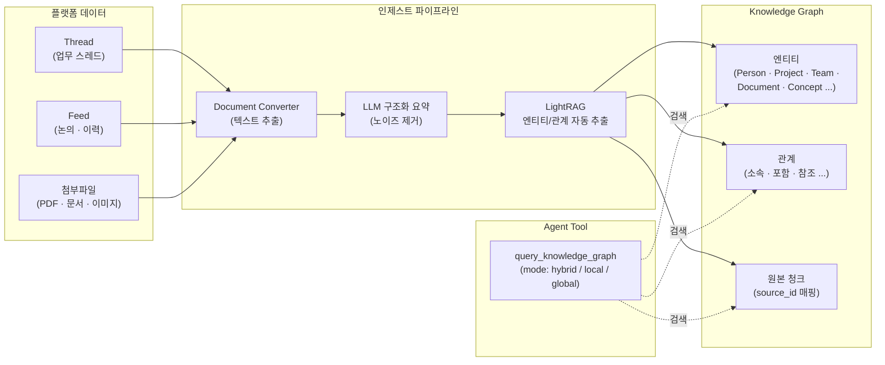

**파이프라인 설계**

1. **텍스트 추출**: 첨부파일 형식별(PDF·문서·이미지 OCR 등) 변환기를 두어 원본을 텍스트로 정규화함.
2. **LLM 구조화 요약**: 원문에서 OCR 노이즈, URL, 보일러플레이트를 제거하고 핵심 엔티티/관계가 명시되도록 재구성함. KG 추출 품질을 직접 끌어올리는 단계.
3. **KG 추출**: LightRAG가 요약본에서 엔티티와 관계를 자동 추출. 도메인 특화 엔티티 타입(Person, Organization, Project, Team, Skill, Technology, Document, Metric 등)을 정의해 업무 도메인 신호를 잃지 않도록 함.
4. **source_id 매핑**: 추출된 엔티티/관계마다 원본 청크의 ID를 유지해, 검색 결과에 원문 근거를 함께 반환할 수 있도록 구성.

**Agent Tool로 노출 — 3가지 검색 모드**

KG 검색은 별도 도구(`query_knowledge_graph`)로 등록되어, 에이전트가 질의 의도에 맞게 모드를 선택함.

| 모드 | 동작 | 사용 시점 |
|------|------|----------|
| `hybrid` (기본) | Local + Global 결과를 Round-Robin 병합 | 대부분의 자연어 질의 |
| `local` | 엔티티 카드를 먼저 찾고 연결된 관계 탐색 | "이 사람/이 프로젝트 주변 맥락" 질의 |
| `global` | 관계를 먼저 찾고 양쪽 엔티티 수집 | 주제·요약 중심 질의 |

**운영상 고려 사항**

- **이벤트 루프 격리**: LightRAG 내부 워커가 최초 이벤트 루프에 바인딩되는 특성 때문에, FastAPI/LangGraph 메인 루프와 분리된 **전용 백그라운드 이벤트 루프**에서 쿼리를 실행하도록 구성. 같은 인스턴스로 반복 호출해도 `Event loop is closed` 에러가 발생하지 않게 함.
- **환각 억제**: LLM 답변 단계에서 "Context 안의 정보만 사용" 제약을 걸고, 엔티티·관계·원본 청크를 함께 컨텍스트로 전달.
- **CRUD 도구와의 분업**: 파일 목록·메타 정보는 기존 CRUD 도구로, 내용 기반 의미 검색은 KG 도구로 라우팅하도록 도구 설명을 명시해 Tool Calling 충돌을 줄임.

**LLMOps Observability 설계**

LLM 기반 Agent는 비결정적(non-deterministic) 특성으로 운영 단계에서 문제가 발생함. 이를 해결하기 위해 5개 Observability Spec을 설계하고, Langfuse + Sentry + Grafana 도구를 선정함.

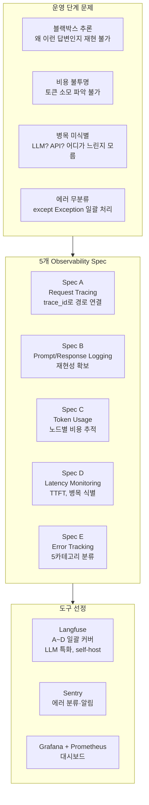

**5개 Observability Spec:**

| Spec | 목적 |
|------|------|
| Request Tracing | trace_id로 에이전트 노드 간 경로를 연결해 비결정적 흐름을 추적 |
| Prompt/Response Logging | LLM 입출력을 구조화 저장해 재현성 확보 및 Hallucination 탐지 |
| Token Usage | 노드별·모델별 토큰 소비를 집계해 비용 주범 특정 |
| Latency Monitoring | TTFT, 노드별 소요 시간을 측정해 병목 식별 |
| Error Tracking | 5개 카테고리(LLM/Parse/Tool/Agent Logic/System)로 분류해 유형별 자동 대응 |

도구는 Langfuse(LLM 특화 tracing, self-host 가능) + Sentry(에러 분류·알림) + Grafana(대시보드)를 선정함.

**기술 스택**: Python, LangGraph, FastAPI, Gemini API, LightRAG (Knowledge Graph), Langfuse, Sentry, Grafana, Prometheus, SSE, Docker Compose

---

### 2. URL 기반 스미싱 탐지 시스템 · Security · ML · Pipeline

**소속**: Plantynet | **역할**: AI 분류 모델 및 파이프라인/모니터링 시스템 구축 담당 — 기존 시스템 분석, 모델 선정·Fine-tuning, 동적 URL 파이프라인 설계·구현

기존 스미싱 탐지는 외부 스캐닝 API로 URL 메타데이터를 수집한 뒤 Random Forest로 분류하는 구조였음. API 실패율이 높고 실환경 F1이 낮아 운영에 한계가 있었음. 특히 단축 URL은 Whois 정보가 없어 대부분 오분류됨.

이 문제를 두 가지 접근으로 해결함 — **URL 텍스트 기반 딥러닝(URLBert)**과 **HTML 구조 기반 동적 URL 분석**.

**[접근 1] URLBert Fine-tuning**

외부 API 의존을 제거하기 위해 URL 텍스트 자체에서 패턴을 학습하는 방식을 택함. URLBert(BERT 기반 경량 모델)를 선택한 이유는: ① URL 도메인 특화 사전학습, ② CPU만으로 학습·추론 가능, ③ 한국형 단축 URL에 적합.

Zero-shot 성능이 부족해 사내 데이터로 Fine-tuning을 수행하여, 기존 Random Forest 대비 F1을 대폭 향상시킴. 실환경 불균형 조건에서도 높은 Precision을 유지함.

**[접근 2] HTML 구조 기반 동적 URL 탐지**

단축 URL은 원본 URL과 랜딩 페이지가 다름. URL 텍스트만으로는 판별이 어려운 케이스를 대응하기 위해, HTTP 리다이렉트를 따라간 뒤 최종 랜딩 페이지의 HTML 구조를 분석하는 파이프라인을 구축함.

피싱 웹사이트 탐지 오픈소스에서 주요 피처를 포팅하고, 한국형 스미싱 특화 피처(전화번호 입력 필드, 택배·본인인증·부고·투자 등 키워드)를 추가해 총 17개 HTML 피처를 설계함.

| 피처 유형 | 피처 | 설명 |
|------|------|------|
| 구조 존재 여부 (7개) | has_form, has_password, has_hidden, has_email_input, has_iframe, has_submit, has_title | HTML 태그 존재 여부 |
| 수량/길이 (8개) | num_inputs, num_scripts, num_links, num_images, num_buttons, text_length, title_length, num_meta | 요소 수·텍스트 길이 |
| 한국형 특화 (2개) | has_tel_input, has_kr_keyword | 전화번호 입력 필드, 택배·본인인증·부고·투자 등 키워드 |

**시스템 아키텍처**

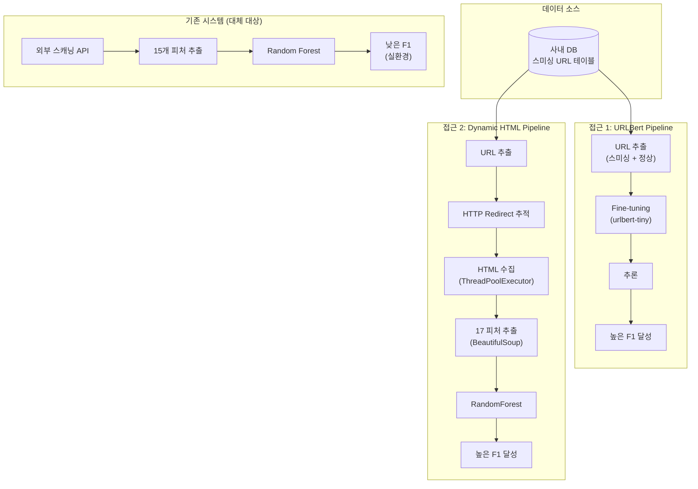

**[접근 3] 파이프라인 오케스트레이션 + 성능 모니터링 시스템**

모델 개발 이후 운영 단계에서 시스템 부하를 줄이고 처리 속도를 높이기 위해, 메모리 기반 3단계 파이프라인과 시계열 모니터링 시스템을 설계·구현함.

**파이프라인 3단계**

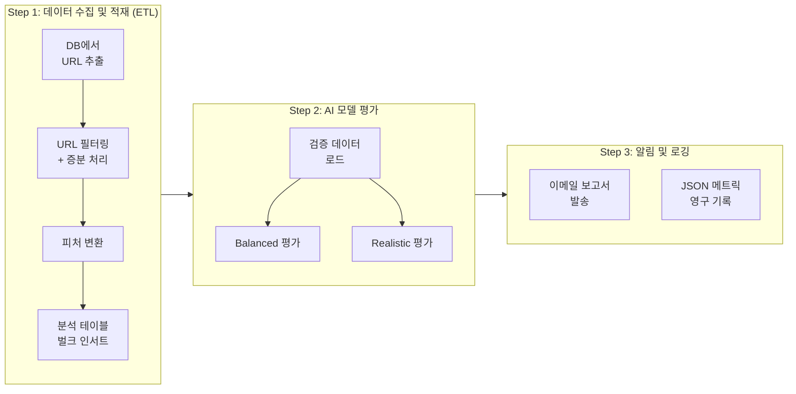

| 단계 | 핵심 동작 | 산출물 |
|------|-----------|--------|
| Step 1 — ETL | DB 추출 → 패턴 필터링 → 증분 대조 → 피처 변환 → 벌크 인서트 | 분석용 테이블 |
| Step 2 — 평가 | Balanced / Realistic 성능 측정 | F1, Accuracy 등 메트릭 |
| Step 3 — 알림 | 이메일 보고서 + JSON 메트릭 영구 기록 | logs/metrics/ |

**모니터링 대시보드**

파이프라인이 생성한 메트릭 산출물을 기반으로, 기존 시스템과 분리된 낮은 결합도의 모니터링 시스템을 구축함. 최근 실행 이력을 유지하면서 이전 실행과 비교해 이상을 감지하는 시계열 분석 중심 설계.

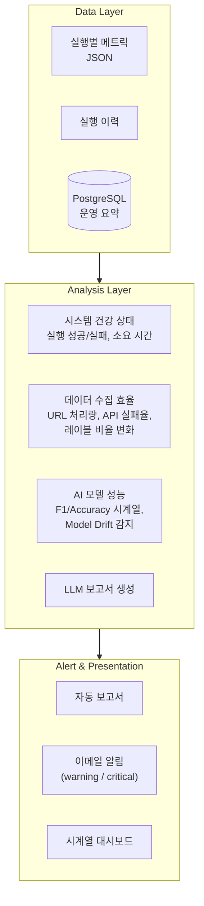

| 모니터링 그룹 | 핵심 지표 |
|:---:|------|
| 시스템 건강 상태 | 실행 성공/실패율, 스텝별 소요 시간, 최근 실행 일시 |
| 데이터 수집 효율 (ETL) | URL 처리량 추이, API 실패 건수, 스미싱 비율 변화 |
| AI 모델 성능 | F1·Accuracy 시계열, Model Drift 감지 |

**실증 사례**: 실제 운영 중 모니터링 시스템이 외부 API 전면 장애를 자동으로 감지해, 기존에는 다음 실행 시점에 수동 확인하기 전까지 인지할 수 없었던 장애를 즉시 포착하고 알림을 발송함.

**기술 스택**: Python, HuggingFace Transformers, scikit-learn, LightGBM, BeautifulSoup4, pandas, Oracle, PostgreSQL, ThreadPoolExecutor

---

### 3. Milvus 기반 Agentic RAG 시스템 · Search · Safety

**소속**: Plantynet (AI 파트 2명) | **역할**: 검색 엔진/전처리/에이전트 전체 담당

사내 매거진 플랫폼에 챗봇을 붙여 기사 검색·추천을 자연어로 할 수 있게 하자는 기획으로 시작된 프로젝트. 기존에는 키워드 매칭만 있어서 의미 기반 질문("여름에 읽기 좋은 글")에 대응이 안 됐음. 생성형 AI 응답의 안전성 검증도 없었음.

Dense 벡터(BGE-M3)와 BM25 Sparse를 합친 하이브리드 검색을 개발함. 도입 후 키워드 검색 대비 Top-5 Recall을 크게 향상시킴. BGE-Reranker-v2-M3로 재정렬하고, 검색된 청크 앞뒤 문맥을 자동으로 붙이는 컨텍스트 윈도우를 넣어서 문맥 잘림을 방지함. 매거진 추천에는 Milvus Group Search를 활용 — 해당 매거진에 속한 모든 청크와의 유사도를 계산한 뒤, 가장 높은 순으로 매거진을 추천하는 방식으로 구현함.

전처리에서 전체 청크 중 100자 이하·특수문자·KoNLPy 토큰 검증 실패 건을 걸러내 노이즈를 제거함.

**시스템 아키텍처**

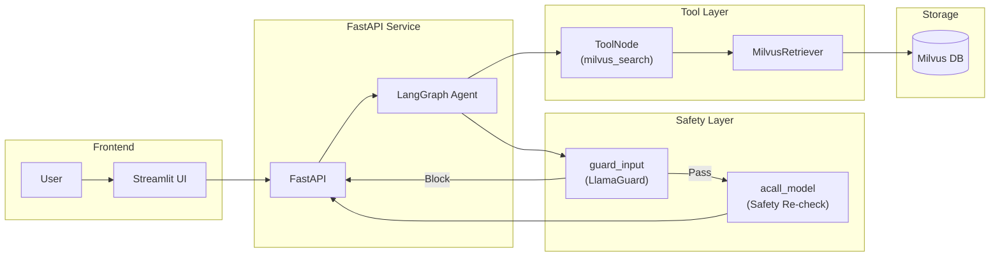

에이전트 흐름은 Safety Guard → Reasoning → Tool Calling → Response 순서임. 입력/출력 모두 LlamaGuard가 검사함. SSE로 토큰 단위 스트리밍, Thread 기반 Checkpoint Store로 대화 이력 관리함.

Docker Compose로 Milvus(벡터 DB) + FastAPI(백엔드) + Streamlit(프론트엔드) 3-tier 구성을 단일 명령으로 배포. 서비스 간 네트워크를 Docker 내부 브릿지로 격리하고, 볼륨 마운트로 데이터 영속성을 보장함.

**기술 스택**: Python, LangGraph, LangChain, FastAPI, Milvus, Streamlit, BGE-M3, BGE-Reranker, MongoDB, PostgreSQL, Docker Compose

---

### 4. vLLM 기반 텍스트 처리 API 서비스 · Serving

**소속**: Plantynet | **역할**: 3명 팀 (중간 LLM 로직 및 서빙 API 개발 파트 담당) — LLM 서빙 및 API 설계·개발·배포

기사 요약, 분류, 태깅을 각각 따로 처리하고 있었는데, 외부 API 호출 비용과 레이턴시가 쌓여서 자체 서빙이 필요해짐. vLLM LLMEngine을 FastAPI 프로세스 안에서 직접 구동하는 in-process 아키텍처로 외부 API 호출 비용을 제거하고 응답 시간을 대폭 단축함. 토큰 레벨 연속 배칭으로 동시 요청 효율을 높이고 asyncio.Semaphore로 GPU 메모리 초과를 방지함.

**주요 기능**
- 기사 요약 (목표 길이 범위 내 수렴 알고리즘)
- 긴 문서 축약 (Map-Refine: 불릿 추출 → 평문 변환)
- 주제 분류 및 분류체계(Taxonomy) 분석
- 키워드/태그 추출 (구조화된 출력 기반)
- Gradio UI (기획팀이 바로 테스트 가능)

v0(기본 vLLM 서빙) / v1(LangGraph 에이전트 기반) 버전 관리로 기존 연동을 깨지 않으면서 점진 전환함. v1에서 LangGraph를 도입한 건 요약 길이 수렴처럼 조건 분기와 재시도가 필요한 작업이 늘었기 때문임. 요약 길이 수렴 성공률을 높은 수준으로 달성함.

Docker + NVIDIA Container Toolkit 기반으로 GPU 서빙 컨테이너를 구성. Multi-stage Dockerfile로 빌드 의존성과 런타임을 분리해 이미지 크기를 최적화하고, Docker Compose로 서비스 기동·업데이트를 자동화함.

**기술 스택**: Python, FastAPI, vLLM, LangGraph, PyTorch, Gradio, Docker, NVIDIA Container Toolkit

---

### 5. 한국어 뉴스 요약 LLM 평가 파이프라인 · Evaluation · LLMOps · Pipeline

**소속**: Plantynet (2명 팀) | **역할**: deepeval 기반 평가 파이프라인 전체 담당 — 평가 메트릭 설계, 5단계 파이프라인 구현, Postgres 적재, cron 자동화·모니터링 | **기간**: 2026.01 ~ 2026.05

요약 LLM이 운영에 투입되면서, 매일 누적되는 대량의 요약 결과(`*_res.json`)에 대해 ① 정상 응답률, ② 길이 비율, ③ 한국어 편집 압축 품질을 일관된 기준으로 측정해야 했음. 기존엔 샘플을 사람이 정성 확인했지만, 데이터 규모와 폴더 변형(`naver_4_2000_3000`, `naver_5_800_2000` 등)이 늘면서 LLM-as-judge로 자동화하는 게 필수가 됨.

핵심 문제는 단순 채점이 아니라 **운영 데이터 전체에 대한 자동·재현 가능 평가**였음 — 폴더 단위 stratified 샘플링, OpenAI 쿼터 실패 자동 재시도, 결과의 결정론적 후검증, 시계열 추적, 보고서·이메일 자동화까지 한 파이프라인으로 묶음.

**시스템 아키텍처 — 5-Stage 파이프라인**

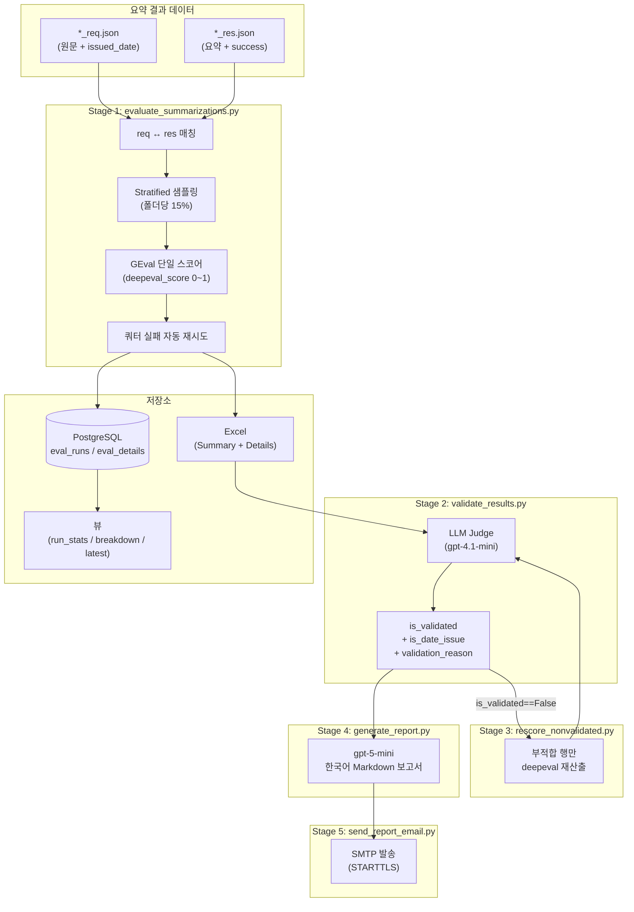

**핵심 평가 메트릭 — 단일 GEval 5축 평가**

deepeval의 GEval은 보통 평가 축마다 metric을 따로 두지만, 한국어 편집 압축은 5개 축(내용·날짜·허위·문체·형식)이 서로 맞물려 한 덩어리로 평가해야 하는 도메인이었음. 5개를 분리하면 같은 입력에 대해 LLM judge가 5번 호출되어 토큰 비용이 약 5배로 늘어나는 것도 문제.

`GEvalTemplate`을 한국어로 오버라이드한 `KoreanGEvalTemplate`을 만들고 5축을 `evaluation_steps`로 묶어, **단일 호출에서 점수 + 한국어 사유**를 한 번에 받도록 설계함.

| 평가 축 | 검증 항목 |
|------|------|
| 내용 보존 | 핵심 사실·인용·통계·고유명사 유지, 서로 다른 개체의 속성 혼합 금지 |
| 날짜 변환 | `issued_date` 기준 상대→절대 날짜 변환 정확도 (예: '지난해' → '2024년') |
| 허위 정보 | input에 없는 주장·이름·수치 도입 금지 (정상 날짜 변환은 제외) |
| 문체 보존 | 어미 혼용·비한국어 텍스트 보존 |
| 형식 준수 | 줄글만 허용, 표·글머리기호·태그 금지 |

`issued_date`를 프롬프트 컨텍스트로 주입해 기사 작성일을 기준으로 절대 날짜 변환의 정확도를 평가 — 운영 단계에서 가장 흔한 오류 유형이었음.

**LLM Judge로 결정론적 후검증 + 불변식 enforcement**

GEval만으로도 점수는 나오지만, 점수와 자연어 사유가 운영 의사결정에는 직접 쓰기 어려움. Stage 2에서 별도 LLM judge(gpt-4.1-mini)가 `deepeval_score`와 `deepeval_reason`을 보고 ① 운영 사용 가능 여부(`is_validated`), ② 날짜 결함 여부(`is_date_issue`), ③ 한국어 사유를 JSON으로 반환.

이때 핵심은 **결정론적 불변식 enforcement** — judge LLM이 어떤 응답을 내든 후처리 단계에서 "`is_validated=True` ⇒ `is_date_issue=False`"를 코드로 강제. 적합 판정은 부적합 사유가 없으므로 날짜 이슈도 정의상 없음. 프롬프트로만 규칙을 거는 방식은 LLM이 종종 위반하기 때문에, 응답 직후 enforce하는 구조로 일관성 확보.

**Stratified 샘플링 + 쿼터 실패 자동 재시도**

폴더(`naver_4_2000_3000`, `naver_5_800_2000` 등) 단위로 데이터 분포가 다르기 때문에, 전체 무작위 샘플로는 폴더 간 비교가 불가. `--sample-pct-per-folder 0.15` 같은 **폴더 단위 stratified 샘플링**을 구현해 success==True 데이터에서 폴더별 일정 비율을 뽑도록 함.

deepeval/judge 모두 OpenAI 호출이라 쿼터·rate limit으로 score=None 행이 산발적으로 발생함. Stage 1과 Stage 2 양쪽에 retry 루프를 구현 — `--retry-failed-max-attempts 3 / --retry-failed-wait-seconds 300 / --retry-failed-workers <half>` 로, OpenAI 자동충전 사이클을 고려한 대기 후 절반의 worker로 재시도. 실패 0건이면 sleep 자체를 skip해 정상 경로 성능에 영향 없음.

**Postgres 적재 + Incremental 평가**

`--save-db` 시 `eval_runs`(실행 단위 집계)와 `eval_details`(파일 단위)를 적재. 핵심은 `(input_root, output_root, source, subdir, filename)` UNIQUE 제약 — 같은 파일이 여러 run에 걸쳐 평가돼도 한 행으로 UPSERT되고 `run_id`는 최근 run을 가리킴.

그 위에 `--incremental` 모드를 얹어, DB에서 이미 평가된 `(source, subdir, filename)` 집합을 빼고 미평가분만 처리. cron으로 매시간 돌리면 누적된 신규 데이터만 채점되어, 자정에 대량 데이터가 들어와도 백로그가 누적되지 않음. `--incremental` 사용 시 `--deepeval-everything`을 자동 강제 — 기본 100건 샘플링이 나머지 행을 NULL 상태로 두면 다음 실행이 그 행을 "완료"로 오인해 침묵 차단하는 함정 방지.

**운영 자동화 — cron + flock**

- 매시 `cron_hourly_eval.sh` (`flock -n /tmp/naver_eval_hourly.lock`로 중복 실행 방지, lock 점유 시 skip 로그 후 exit 0 → 정상 cron 패턴 유지)
- 일 1회 누적 보고서 + 이메일(`cron_cumulative_report.sh`, `cron_send_email.sh` 01:00 UTC / 10:00 KST)
- `MAX_FILES=2000` 시간당 throughput 캡으로 초기 백로그가 한 run을 독점해 다음 cron을 starve시키는 걸 방지

**결과**

- 운영 데이터 시간당 수천 건을 사람 개입 없이 평가·검증·보고서화하는 무중단 파이프라인 완성
- 단일 GEval 설계로 토큰 비용을 5축 분리 대비 약 1/5 수준으로 절감
- `is_date_issue` 후검증 도입으로 운영에서 가장 흔한 오류 유형(상대→절대 날짜 오변환)을 별도 지표로 시계열 추적
- Stratified 샘플링 + Postgres 누적 적재로 폴더별·시계열 품질 추이가 자동 산출되어 모델 변경의 회귀 여부를 다음 cron 주기에 바로 감지 가능

**기술 스택**: Python, deepeval (GEval), OpenAI API (gpt-4.1-mini, gpt-5-mini), PostgreSQL, openpyxl, ThreadPoolExecutor, cron + flock, SMTP (STARTTLS)

---

### 6. 부산관광공사 여행 스케줄링 챗봇 · Search · Service

**소속**: AIO2O (5명 팀) | **역할**: AI 파트 리드 — 벡터 DB 구축, 추천 알고리즘, 챗봇 개발

기존에는 사람이 직접 짜놓은 추천 코스만 제공할 수 있었고, "부산 / 1박 2일 / 맛집" 같은 고정 필터 수준이었음. "아이랑 갈 만한 조용한 곳" 같은 자연어 질의엔 대응이 안 됨.

관광공사 데이터(관광지 설명, 장소, 평점, 리뷰 등)를 활용해 벡터 DB를 구성함. 특히 관광지 설명과 후기를 적극적으로 활용 — 리뷰에서 긍정적 키워드, 부정적 키워드, 해시태그를 추출해 벡터 입력에 함께 반영함으로써 의미 기반 검색 품질을 높였음.

영화 추천에서 쓴 2단계 알고리즘을 여행 도메인에 맞게 바꿈. 메타 필터링(지역, 숙박 일수, 카테고리) → 벡터 유사도(여행지 설명, 후기 키워드, 해시태그를 포함한 통합 벡터). 추천 결과로 일정 구성까지 해줌. **현재 부산관광공사(Visit Busan)에서 상용 운영 중.**

**서비스 링크**: [Visit Busan](https://www.visitbusan.net/index.do?menuCd=DOM_000000203018000000)

Docker Compose로 API 서버와 벡터 DB를 컨테이너화하여 배포. 환경별 설정을 .env 파일로 분리하고, 배포 프로세스를 자동화함.

**기술 스택**: Python, Embedding Models, Vector DB, NLP, Docker Compose

---

### 7. Skylife 영화 추천 시스템 · Search

**소속**: AIO2O (4명 팀) | **역할**: AI 파트 담당 — 벡터 DB 설계, 추천 알고리즘 개발

장르·배우 같은 메타 필터만으로 추천하면 비슷한 결과만 나옴. 영화 메타 정보(장르, 내용 요약, 감독, 배우)를 임베딩해서 PostgreSQL + pgvector에 넣고, 추천을 2단계로 나눔 — 메타 필터링으로 후보를 줄인 뒤, 영화 설명 벡터 유사도로 순위를 매기는 방식. 기존 메타 필터 대비 추천 다양성이 개선되어, 같은 조건에서도 유사하되 새로운 영화가 추천됨.
Docker 기반으로 API 서버를 컨테이너화하여 배포. Dockerfile로 개발/스테이징/운영 환경을 동일하게 유지함.

**기술 스택**: Python, PostgreSQL, pgvector, Embedding Models, Docker

---

### 8. MarketScope AI — 지도 기반 AI 상권분석 서비스 (Side Project) · Full-Stack · Agent · SaaS

**역할**: 1인 Full-Stack 개발 (기획 · 설계 · 프론트엔드 · 백엔드 · AI Agent · 인프라) | 2026.01 ~ 현재 (운영 중)

지도에서 상권을 선택하면 AI가 자연어로 분석해주는 Freemium SaaS. 소상공인/부동산 투자자 대상. 현재 서울시 **1,650개 상권** 실데이터를 적재해 [marketscope.robitlabs.co.kr](https://marketscope.robitlabs.co.kr) 에서 운영 중.

<p align="center">
  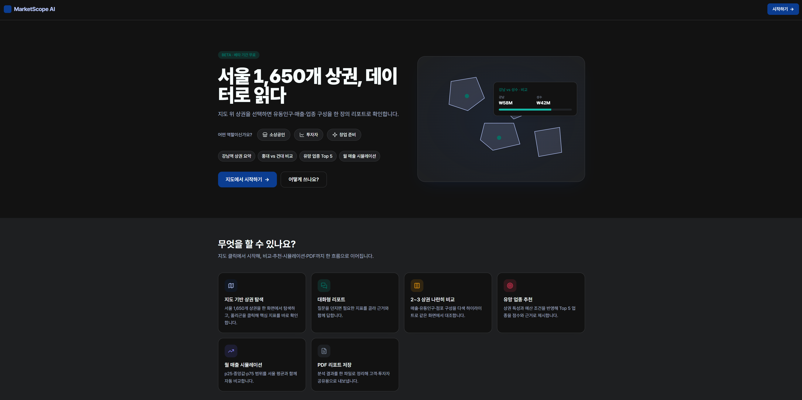
</p>
<p align="center"><i>랜딩 페이지 — 역할 선택(소상공인 · 투자자 · 창업 준비) + 스타터 칩 + "지도에서 시작하기" CTA</i></p>

<table>
<tr>
<td align="center"><b>Light Mode</b></td>
<td align="center"><b>Dark Mode</b></td>
</tr>
<tr>
<td>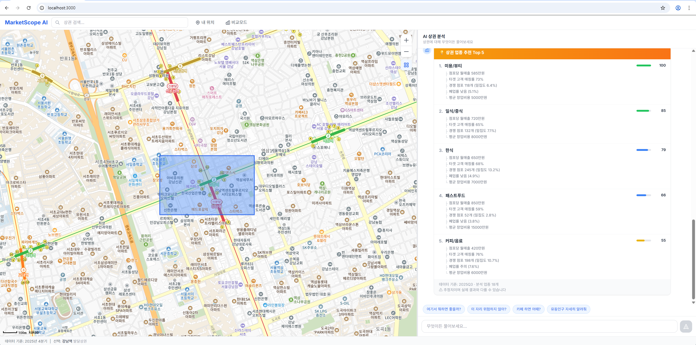</td>
<td>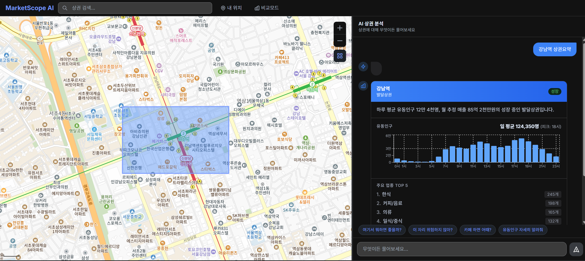</td>
</tr>
</table>

**Demo Video**

https://github.com/user-attachments/assets/48b6440a-f1d1-4e5e-b3e3-527d8b5deddf

**기존 서비스 대비 차별점**: 기존 상권분석 서비스는 정적 대시보드 + 수동 필터 방식으로, 사용자가 직접 지표를 찾아 비교해야 함. MarketScope AI는 "강남역 카페 매출 추이", "홍대랑 비교해줘" 같은 자연어 한 줄로 AI가 실시간 분석하고 지도와 연동해 시각화까지 해주는 것이 핵심 차별 기능.

**시스템 아키텍처**

```
┌─────────────────────────────────────────────────────────────────────┐
│                        CLIENT (Browser)                             │
│  ┌─────────────────────────┬───────────────────────────────────┐    │
│  │     Map Panel (Left)    │       Chat Panel (Right)          │    │
│  │  ┌───────────────────┐  │  ┌─────────────────────────────┐  │    │
│  │  │  Kakao Map SDK    │  │  │  Natural Language Input     │  │    │
│  │  │  + Polygon Layer  │  │  │  + Streaming Response       │  │    │
│  │  │  + Heatmap Layer  │  │  │  + Rich Cards (chart/table) │  │    │
│  │  │  + Marker Layer   │  │  │  + Suggestion Chips         │  │    │
│  │  └───────────────────┘  │  └─────────────────────────────┘  │    │
│  └─────────────────────────┴───────────────────────────────────┘    │
│                         Next.js 14 (App Router)                     │
└──────────────────────────────┬──────────────────────────────────────┘
                               │  REST + SSE Streaming
                               ▼
┌─────────────────────────────────────────────────────────────────────┐
│                        API GATEWAY (FastAPI)                        │
│  /api/chat    /api/districts    /api/reports    /api/map-data       │
└──────────┬──────────────────────────────────────────────────────────┘
           │
     ┌─────┴──────────────────────────────┐
     ▼                                    ▼
┌──────────────────┐          ┌──────────────────────────────────┐
│   AI Agent Layer │          │         Data Layer               │
│  (LangGraph)     │          │                                  │
│  ┌────────────┐  │  tool    │  ┌────────────┐ ┌────────────┐   │
│  │  PAE       │──┼──call───►│  │ PostgreSQL │ │   Redis    │   │
│  │  Planner→  │  │          │  │ + PostGIS  │ │  (Cache)   │   │
│  │  Actor→    │  │          │  └────────────┘ └────────────┘   │
│  │  Evaluator │  │          └──────────────────────────────────┘
│  ┌────────────┐  │
│  │ Langfuse   │  │
│  │ (Tracing)  │  │
│  └────────────┘  │
└──────────────────┘
```

**기술 스택**

| 레이어 | 기술 | 선정 이유 |
|--------|------|-----------|
| Frontend | Next.js 14 (App Router, TypeScript), Kakao Map SDK, deck.gl, Recharts, Zustand, shadcn/ui + Tailwind | SSR 지원, 한국 지도 데이터 정확도, 고성능 지도 시각화, 경량 상태 관리 |
| Backend | FastAPI (Python 3.12, async), LangGraph (커스텀 PAE 그래프), Claude Sonnet 4 + Gemini | 비동기 SSE 스트리밍, 의도 분류·병렬 실행·충분성 평가 분리, 역할별 LLM 최적화 |
| Database | PostgreSQL 16 + PostGIS, Redis 7 | 상권 폴리곤 공간 쿼리(ST_Contains, ST_Within), 분기별 캐싱 |
| Infra | Docker Compose, Playwright E2E, GitHub Actions CI/CD | 로컬 개발 환경 통합, 자동화 테스트, 지속적 통합 |
| Observability | Langfuse | LLM 호출 트레이싱, 비용 추적, 프롬프트 버전 관리 |

**주요 기능 및 구현 상세**

**① AI Chat 기반 상권분석 (핵심 차별 기능)**
초기엔 `create_react_agent` 기반 ReAct 루프로 시작했는데, 툴 호출이 늘면서 의도 분류 → 병렬 실행 → 충분성 평가를 분리할 필요가 생겨 **LangGraph 커스텀 PAE(Planner-Actor-Evaluator) 그래프**로 재설계함. Planner가 50+ 규칙으로 intent를 분류하고(LLM fallback), Actor가 Plan을 DAG로 위상 정렬해 `asyncio.gather`로 Tool을 병렬 실행하며, Evaluator가 결과 충분성을 판정해 insufficient이면 최대 3 rounds까지 재진입함. **11종 Tool**(상권 요약, 유동인구, 매출, 점포, 인구, 점포 이력, 상권 비교, 업종 추천, 매출 시뮬레이션, 상권 벤치마크, 유동인구 이상 감지)을 자동 선택·조합해 복합 질의를 처리함. 역할별 LLM 분리 — Planner는 Claude Sonnet 4(tool_use 정확도), Evaluator는 Gemini flash(저비용), Respond는 Gemini pro(한국어 스트리밍). Circuit Breaker + 재시도/폴백으로 LLM/DB 장애 시 graceful degradation 동작.

**② 지도-챗봇 양방향 동기화**
Zustand store 기반으로 지도 ↔ 챗봇 상태를 실시간 연동함. 지도에서 상권 폴리곤을 클릭하면 AI가 자동으로 해당 상권 분석을 시작하고, 채팅 응답에 포함된 map_cmd 이벤트로 지도 하이라이트/이동/줌을 제어함.

**③ Rich Card UI 5종 + SSE 스트리밍**
- **SummaryCard**: 상권 기본 리포트 (유동인구, 매출, 점포 현황 + Recharts 바차트)
- **CompareCard**: 최대 3개 상권 비교표 + AI 종합 의견
- **RecommendCard**: 업종별 추천 점수바 + 추천 근거 + 면책 조항
- **RiskCard**: 점포 안정성 게이지 + 생존 기간 바차트
- **SimulationCard**: 업종별 월매출 p25/평균/p75 시뮬레이션 + 서울 평균 대비 비교

FastAPI SSE로 thinking → plan → tool → tool_end → card → text → suggestion → done 9종 이벤트를 실시간 스트리밍해, 사용자가 AI의 사고 과정을 실시간으로 확인할 수 있음.

**④ Freemium SaaS 비즈니스 모델**
무료(일 5회 질의 + 기본 리포트) / Premium(무제한 + 업종 심층 분석 + 히트맵 + 매출 시뮬레이션 + PDF 리포트)로 Tier를 나누고, Tier 게이팅 인프라를 설계함.

**⑤ 랜딩/앱 라우트 분리 + 응답 정확성 개선**
`/` 랜딩(역할 선택 · 스타터 칩 · Hero/Bento/HowItWorks) 과 `/app` 챗맵을 라우트로 분리해 첫 진입 맥락과 실사용 화면을 구분함. 응답 정확성을 끌어올리기 위해 (a) **Entity Linking** — 상권명 prefix/trigram 매칭 + `learned_aliases` 테이블로 약칭·오탈자 학습, (b) **Abstention** — Tool 실패·빈 결과 시 추측 대신 부재 고지 템플릿 강제, (c) **Query Rewriter** — 이전 턴 맥락을 반영한 질의 재작성으로 follow-up 정확도 보강. `/api/feedback/score` 엔드포인트로 사용자 피드백을 **Langfuse trace score** 로 역연동해 실데이터 기반 개선 루프 구축.

**E2E 검증**
Playwright로 feature 7종 + Ring 0~3 시나리오 구조(preflight · features · journeys · negative)로 전체 흐름을 검증함:
- 폴리곤 클릭 → Agent 응답 → SummaryCard 렌더링
- 대화 컨텍스트 유지, 지도-챗봇 양방향 동기화
- SSE 스트리밍 진행 표시, Card 렌더링, 에러 처리
- Mock/Real 2개 모드에서 동일 시나리오 회귀

**데이터 파이프라인**
서울 열린데이터 4개 서비스(`VwsmTrdarFlpopQq` 외) + SHP 폴리곤을 분기별로 수집하는 ETL 파이프라인 구축. 적재량 약 14.6만 건(유동인구 9,888 / 추정매출 21,333 / 점포 75,985 / 상주·직장인구 39,288). Repository 패턴(9개 프로토콜)으로 Mock(JSON fixture) · Real(SQLAlchemy async) 두 구현체를 두어, `USE_MOCK` 환경변수 하나로 DB 없이 FastAPI 단독 기동과 실데이터 모드를 전환함.

**현재 상태**: Phase 1A(Mock E2E) / Phase 1B(실데이터 ETL + 1,650개 상권) / Phase 3(히트맵 · 매출 시뮬레이션 · PDF 리포트) 완료 · **v0.4.0 프로덕션 라이브** ([marketscope.robitlabs.co.kr](https://marketscope.robitlabs.co.kr)). Playwright E2E ring0~3 chromium 66/66 PASS + prod-smoke 28/28 PASS. Langfuse SDK v3 포팅으로 프로덕션 trace 실발행 · `done.trace_id` ↔ 서버 로그 매핑 확인. Phase 2(OAuth2 · 결제 · Tier 게이팅) 진행 예정.

---

## 연구 개발 자료

- [Notion 연구 개발 노트](https://www.notion.so/76-Inside-the-Scaffold-A-Source-Code-Taxonomy-of-Coding-Agent-Architectures-341736a271928198b64adeca0b3eec43)
- [개발 연구자료 정리 저서 — 『Agentic AI: 스스로 진화하는 인공지능 에이전트 만들기』](https://wikidocs.net/book/19070)
  90일 기준 페이지뷰 9,234 · 방문자 8,785 · 평균 체류시간 12분 · 이탈률 1.0%

---

## 연락처

- 이메일: cyon13022@gmail.com
- GitHub: [github.com/SJayKim](https://github.com/SJayKim)
- Wikidocs 저서: [『Agentic AI: 스스로 진화하는 인공지능 에이전트 만들기』](https://wikidocs.net/book/19070)
