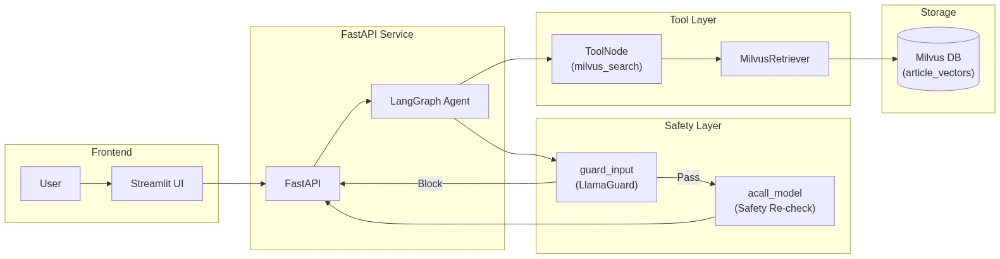
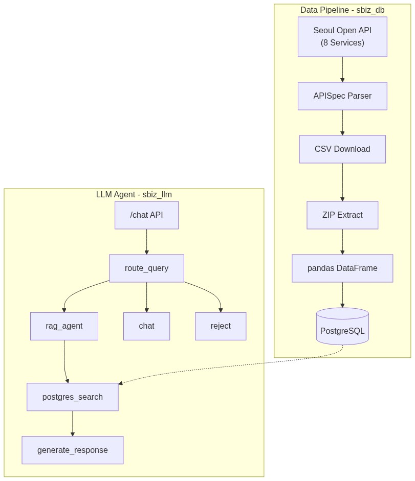
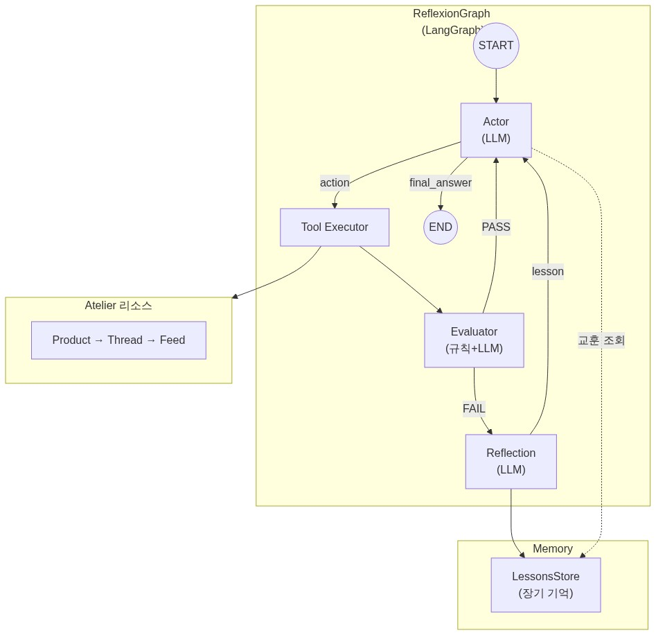

# Portfolio

## 소개

UNIST(울산과학기술원) 산업공학과 석사 졸업 (2023)

LLM 기반 AI 서비스 개발 경험을 보유한 백엔드/AI 엔지니어입니다. vLLM, LangGraph, RAG 시스템 구축부터 데이터 파이프라인, API 서비스까지 End-to-End 개발 경험이 있습니다.

## 학위 논문

**Personal recommender system via convolutional autoencoder with conditioning augmentation**

Recommender system and representation learning with convolutional autoencoder

Kim, Sunjun (2023) | UNIST 산업공학과 석사

[논문 링크](https://apac-tc.hosted.exlibrisgroup.com/primo-explore/fulldisplay?docid=82UNIST_INST21228494070002596&vid=82UNIST&search_scope=everything&tab=everything&lang=ko_KR&context=L)

---

## 프로젝트 목록

| 구분 | 프로젝트 | 설명 | 역할 |
|------|----------|------|------|
| AIO2O | [Skylife 영화 추천 시스템](#aio2o-1-skylife-영화-추천-시스템) | 임베딩 벡터 기반 영화 추천 | 벡터 DB 구축, 추천 알고리즘 |
| AIO2O | [부산관광공사 여행 챗봇](#aio2o-2-부산관광공사-여행-스케줄링-챗봇) | 여행지 추천 챗봇 (상용 서비스) | 벡터 DB 구축, 추천 알고리즘 |
| Plantynet | [AI_LLM_API](#plantynet-3-ai_llm_api) | vLLM 기반 텍스트 처리 API 서비스 | 전체 개발 |
| Plantynet | [RAG 시스템](#plantynet-4-rag-시스템-ai_prompt--rag-chatbot) | Milvus 기반 Agentic RAG 챗봇 | 데이터 전처리, 벡터 DB, 검색 |
| Plantynet | [Reflexion Agent](#plantynet-5-reflexion-agent-mcp-host) | ReAct + Reflexion 자기개선 AI 에이전트 | 전체 설계 및 개발 |
| Side Project | [서울 상권분석 시스템](#side-project-6-서울-상권분석-시스템-sbiz_db--sbiz_llm) | 상권 데이터 수집 및 LLM Agent 분석 | 전체 개발 |

---

## 기술 스택

| 분류 | 기술 |
|------|------|
| Language | Python |
| LLM/AI | vLLM, LangChain, LangGraph, LiteLLM, OpenAI API, HuggingFace |
| Vector DB | Milvus, Pgvector |
| Database | PostgreSQL, Oracle, Mysql |
| Backend | FastAPI, Uvicorn |
| Frontend | Streamlit, Gradio |
| Infra | Docker, Docker Compose |
| Embedding | BGE-M3, BGE-Reranker, Sentence-Transformers |
| Protocol | MCP (Model Context Protocol), SSE, JSON-RPC |

---

## 프로젝트

### [AIO2O] 1. Skylife 영화 추천 시스템

**역할**: 벡터 DB 구축, 추천 알고리즘 개발

임베딩 벡터 기반 영화 콘텐츠 추천 시스템. 영화 메타데이터를 벡터화하여 의미 기반 유사도 검색 구현.

**주요 기능**
- 영화 메타 정보 임베딩 (장르, 내용, 감독, 배우 등)
- PostgreSQL + pgvector 기반 벡터 DB 구축
- 메타 필터링 + 벡터 유사도 결합 추천 알고리즘

**추천 알고리즘**
- 1단계: 메타 필터링 (장르, 배우, 감독 조건 적용)
- 2단계: 벡터 유사도 검색 (영화 설명/내용 의미적 유사도)

**기술 스택**: Python, PostgreSQL, pgvector, Embedding Models

---

### [AIO2O] 2. 부산관광공사 여행 스케줄링 챗봇

**역할**: 벡터 DB 구축, 추천 알고리즘 개발

자연어 질의 기반 여행 관광지 추천 챗봇. 현재 부산관광공사에서 상용 서비스 중.

**주요 기능**
- 여행지 관련 메타 데이터 임베딩 및 벡터 DB 구축
- 메타 필터링 + 벡터 유사도 결합 추천 알고리즘
- 여행 스케줄링 기능

**추천 알고리즘**
- 1단계: 메타 필터링 (지역, 여행 기간 1박/2박, 카테고리 등 조건 적용)
- 2단계: 벡터 유사도 검색 (여행지 설명, 후기, 활용 정보 의미적 유사도)

**서비스 링크**: [Visit Busan](https://www.visitbusan.net/index.do?menuCd=DOM_000000203018000000)

**기술 스택**: Python, Embedding Models, Vector DB, NLP

---

### [Plantynet] 3. AI_LLM_API

**역할**: 전체 개발 담당

LLM 기반 텍스트 처리 API 서비스. vLLM 엔진을 FastAPI 프로세스 내에서 직접 구동하여 효율적인 추론 파이프라인 구축.

**주요 기능**
- 기사 요약 API (목표 길이 수렴 알고리즘 적용, 70~130% 범위 내 수렴)
- 긴 문서 축약 (Map-Refine 파이프라인: 불릿 추출 -> 평문 기사 변환)
- 주제 분류 및 분류체계(Taxonomy) 분석
- 키워드/태그 추출 (구조화된 출력 기반)
- Gradio UI 제공 (Chatbot, Summarization, Topic/Taxonomy Classification)

**기술적 특징**
- vLLM LLMEngine in-process 아키텍처
  - 토큰 레벨 연속 배칭으로 동시 요청 효율 향상
  - asyncio.Semaphore로 최대 동시 LLM 연산 슬롯 관리
- LangGraph 기반 에이전트 구현
  - SummarizationAgent: target_text_instructions와 적응형 재시도(+-10%)
  - ReduceAgent: MAP-REFINE 파이프라인
  - KeywordAgent: 구조화된 출력 기반 태깅
  - AbstractAgent: 다중 기사 요약 통합
- API 버전 관리 (v0: 기본, v1: LangGraph 기반)

**API Endpoints**
```
POST /summarize_article         - 기사 요약
POST /summarize_magazine        - 긴문서 축약 (Map-Refine)
POST /classify_topic_from_article    - 주제 분류
POST /classify_taxonomy_from_article - 분류체계 분석
POST /generate                  - 자유 대화
```

**기술 스택**: Python, FastAPI, vLLM, LangGraph, LangChain, PyTorch, Gradio

---

### [Plantynet] 4. RAG 시스템 (AI_PROMPT + RAG-Chatbot)

**역할**: 데이터 전처리, 벡터 DB 구현, 검색 기능 구현

Milvus 기반 Agentic RAG 시스템. 한국어 매거진/문서 검색과 생성형 AI를 결합한 질의응답 챗봇.

**시스템 아키텍처**



**주요 기능**

[검색 시스템]
- 하이브리드 검색: Dense 벡터 검색 + BM25 Sparse 키워드 검색 결합
- Reranking: BGE-Reranker-v2-M3 모델로 검색 결과 재정렬
- 컨텍스트 윈도우: 검색된 청크 주변 문맥 자동 확장 (window_size 설정)
- 날짜/매거진 필터링 지원

[Agent 시스템]
- Agentic RAG Loop: Safety Guard -> Reasoning -> Tool Calling -> Response
- LlamaGuard 기반 입출력 안전성 검증 (입력/출력 이중 검증)
- SSE 스트리밍 (token, message, timing, error 이벤트)
- Thread 기반 대화 히스토리 관리 (Checkpoint Store)
- MongoDB/PostgreSQL/SQLite 체크포인터 지원

**기술적 특징**

[임베딩 & 검색]
- BGE-M3 임베딩 모델 (1024차원 Dense Vector)
- BGE-Reranker-v2-M3 재정렬 모델
- COSINE 유사도 메트릭, nprobe=64
- 파라미터화된 검색 설정 (settings.py 중앙 관리)

[데이터 전처리]
- 100자 이상 청크 필터링
- 특수문자 제거 및 토큰 기반 검증
- KoNLPy 기반 한국어 텍스트 처리 최적화

[Agent 구현]
- LangGraph StateGraph 기반 그래프 구성
- AgentState: messages, remaining_steps, retrievals 관리
- wrap_model: SystemMessage 주입 + Tool 바인딩
- ToolNode로 milvus_search 실행 후 model로 재라우팅

**코드 구조**
```
src/agents/
  rag_assistant.py    - RAG Agent 그래프 정의 (guard_input -> model -> tools)
  milvus_tool.py      - MilvusRetriever 래퍼
  tools.py            - milvus_search 도구 등록
  llama_guard.py      - 안전성 검증
  milvus_key_search/  - 검색 엔진 코어

app/
  rag_api.py          - FastAPI 검색 API
  rag_query.py        - 쿼리 처리
```

**기술 스택**: Python, LangGraph, LangChain, FastAPI, Milvus, Streamlit, BGE-M3, BGE-Reranker, MongoDB, PostgreSQL

---

### [Side Project] 6. 서울 상권분석 시스템 (sbiz_db + sbiz_llm)

**역할**: DB 스키마 구성/구축, LLM 구현, Prompt 구현, 백엔드/프론트엔드 구현

서울 열린데이터광장 상권 데이터를 수집하고, LLM Agent로 분석하는 End-to-End 시스템.

**시스템 아키텍처**



**주요 기능**

[데이터 수집 - sbiz_db]
- 서울 Open API 8개 상권 서비스 자동 동기화
- APISpec 클래스로 HTML 파싱 -> 메타데이터/스키마 추출
- download/export_csv 메서드 지원 (fallback 처리)
- pandas DataFrame 컬럼 매핑 (한글 -> 영문)
- UPSERT 방식 중복 없이 저장
- CLI 지원: --inf-id, --sync-all, --list, --validate

[LLM Agent - sbiz_llm]
- 쿼리 라우팅: rag (상권 질문) / chat (일반 대화) / reject (거부)
- Tool Calling 기반 PostgreSQL 동적 검색
- 9개 상권 테이블 지원
- 비동기 처리 (asyncpg)

**지원 데이터 (9개 테이블)**

| 테이블 | 설명 | 주요 컬럼 |
|--------|------|-----------|
| trdar_relm | 상권 영역 (마스터) | trdar_cd, trdar_cd_nm, signgu_cd |
| trdar_selng | 추정 매출 | thsmon_selng_amt, ml/fml_selng_amt, 요일별/연령별 |
| trdar_stor | 점포 수 | stor_co, opbiz_stor_co, clsbiz_stor_co |
| trdar_flpop | 유동 인구 | tot_flpop_co, 성별/연령별/요일별 |
| trdar_rspop | 상주 인구 | tot_rspop_co, apt_hshold_co |
| trdar_wrcpop | 직장 인구 | tot_wrc_popltn_co, 성별/연령별 |
| trdar_rent | 임대료 | rent_area_div_avg, rent_fee_div_avg |
| trdar_ix | 상권 변화 지표 | trdar_chnge_ix, opbiz_rt, clsbiz_rt |
| trdar_fclty | 집객 시설 | 병원/은행/학교/지하철역 등 시설 수 |

**기술적 특징**

[데이터 동기화]
- inf_id 기반 서비스 정의 (OA-15560, OA-15572 등)
- 스키마 검증 후 DB 저장
- Primary Key 기반 UPSERT
- 크론잡 자동 동기화 지원

[LLM Agent]
- LangGraph StateGraph 기반 그래프
- Pydantic BaseModel로 Tool Input 스키마 정의
- PostgresSearchInput: table_name, stdr_yyqu_cd, trdar_cd, limit 등
- 시스템 프롬프트 중앙 관리 (src/core/prompts.py)

**코드 구조**
```
sbiz_db/
  data_sync.py        - 메인 동기화 서비스
  api_spec.py         - 서울 API 스펙 파서
  init_db/01_schema.sql - DB 스키마

sbiz_llm/src/
  agents/
    sbiz_agent.py     - LangGraph Agent
    tools/postgres_search.py - PostgreSQL 검색 도구
    subagents/query_router.py - 쿼리 라우팅
  core/
    settings.py       - Pydantic Settings
    prompts.py        - 시스템 프롬프트
  service/
    service.py        - FastAPI 서비스
```

**기술 스택**: Python, LangGraph, FastAPI, PostgreSQL, asyncpg, pandas, BeautifulSoup4, psycopg2, Docker

---

### [Plantynet] 5. Reflexion Agent (MCP Host)

**역할**: 전체 설계 및 개발 담당

LangGraph 기반 ReAct + Reflexion 패턴 자기 개선형 AI 에이전트. 자연어 명령으로 작업을 수행하고, 실패 시 원인을 분석하여 교훈을 학습하는 시스템. Atelier 프론트엔드와 호환되는 Product > Thread > Feed 계층 구조 리소스 관리 지원.

**시스템 아키텍처**



**주요 기능**

| 기능 | 설명 |
|------|------|
| **ReAct 패턴** | Thought → Action → Observation 루프 기반 추론 |
| **Reflexion 패턴** | 실패 시 원인 분석 → 교훈 도출 → 장기 기억 저장 → 재시도 |
| **2단계 평가** | 규칙 기반 (에러 키워드) + LLM 기반 정밀 판단 |
| **장기 기억** | problem/solution 형태로 교훈 저장, 유사 상황에서 재활용 |
| **Early Stopping** | 연속 실패 감지 시 조기 종료 |

**리소스 계층 구조 (Atelier 호환)**

```
Product (프로덕트)
└── Thread (스레드) - title, goal, startDate, endDate
    └── Feed (피드) - title, content, category, comments
```

**사용 가능한 도구 (17개)**

| 분류 | 도구 |
|------|------|
| Product | create, list, update, delete |
| Thread | create, list, update, delete |
| Feed | create, list, update, delete |
| Comment | add_comment |
| Utility | search_resources, get_summary, get_metadata |

**기술적 특징**

- **LangGraph StateGraph**: 4개 노드 (Actor, Tool Executor, Evaluator, Reflection) 그래프 구성
- **다중 LLM 지원**: Google Gemini, OpenAI, Anthropic 전환 가능
- **설정 기반**: YAML 파일로 LLM, 에이전트, 프롬프트 설정 관리
- **메모리 시스템**: Short-term (세션 히스토리) + Long-term (교훈 저장소)


**기술 스택**: Python, LangGraph, LangChain, Google Gemini, OpenAI, Anthropic, Pydantic, YAML

---

## 연구 개발 자료

- 📚 [Notion 연구 개발 노트](https://www.notion.so/2f5736a271928061be4ac9554a9c670c?v=2f5736a2719280dfb9a4000c215b258e&p=2f5736a2719280d89a4ada3827ad5965&pm=s)

---

## 연락처

- 이메일:cyon13022@gmail.com

