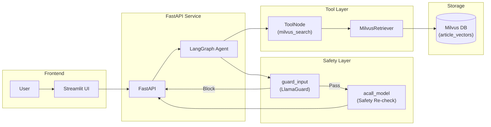
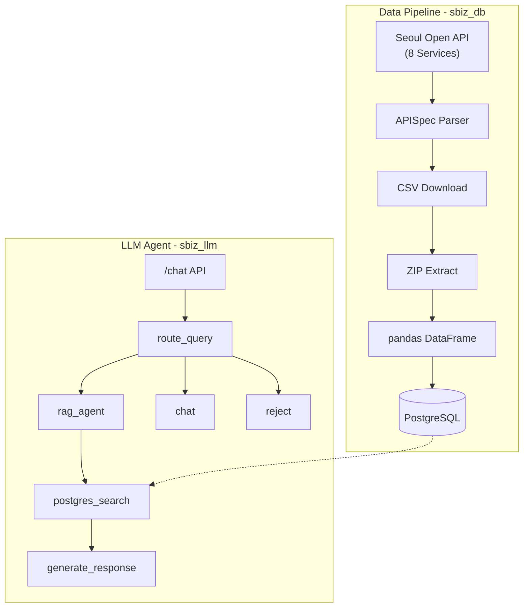
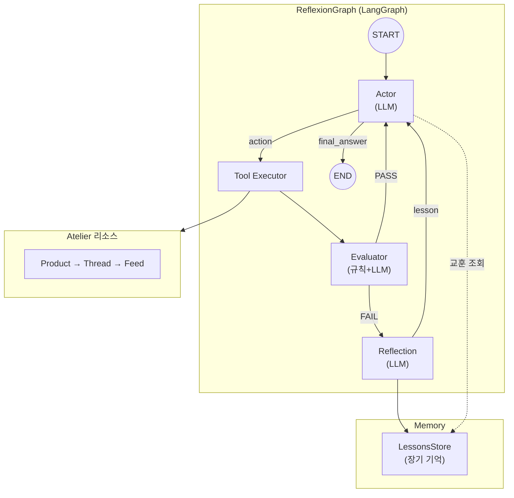

# 포트폴리오

## 소개

> **김선준** | UNIST 산업공학과 석사 (2023)
> 벡터 검색과 LLM Agent 기반 서비스를 만드는 백엔드/AI 엔지니어

석사 때 추천 시스템을 연구했고, 졸업 후에는 그 경험을 벡터 DB 구축, vLLM 서빙, RAG, Agent 시스템 프로젝트를 참여하며 경험을 쌓았습니다. 

---

## 학위 논문

**Personal recommender system via convolutional autoencoder with conditioning augmentation**

Convolutional Autoencoder로 사용자 선호를 잠재 벡터로 표현하고, 벡터 유사도로 아이템을 추천하는 연구. 이때 다룬 임베딩-검색 구조가 이후 pgvector, Milvus 프로젝트 진행에 도움이 많이 되었습니다.

Kim, Sunjun (2023) | UNIST 산업공학과 석사
[논문 링크](https://apac-tc.hosted.exlibrisgroup.com/primo-explore/fulldisplay?docid=82UNIST_INST21228494070002596&vid=82UNIST&search_scope=everything&tab=everything&lang=ko_KR&context=L)

---

## 기술 스택

| 분류 | 기술 |
|------|------|
| LLM Serving & Agent | vLLM, LangGraph, LangChain, MCP |
| Vector DB & Embedding | Milvus, Pgvector|
| Backend & Infra | Python, FastAPI, PostgreSQL, Oracle, Docker |

---

## 프로젝트

### 1. Skylife 영화 추천 시스템 · Search

**소속**: AIO2O | **역할**: 벡터 DB 구축, 추천 알고리즘 개발

장르·배우 같은 메타 필터만으로 추천하면 비슷한 결과만 나오는걸 개선하고자함. 영화 메타 정보(장르, 내용 요약, 감독, 배우)를 임베딩해서 PostgreSQL + pgvector에 넣고, 추천을 2단계로 나눔 — 메타 필터링으로 후보를 줄인 뒤, 영화 설명 벡터 유사도로 순위를 매기는 방식. 석사 때 연구한 임베딩-검색 구조를 처음으로 실서비스에 적용한 프로젝트.

**기술 스택**: Python, PostgreSQL, pgvector, Embedding Models

---

### 2. 부산관광공사 여행 스케줄링 챗봇 · Search · Service

**소속**: AIO2O | **역할**: 벡터 DB 구축, 추천 알고리즘 개발

기존 여행 검색은 "부산 / 1박 2일 / 맛집" 같은 고정 필터 수준이었다. "아이랑 갈 만한 조용한 곳" 같은 자연어 질의엔 대응이 안 됨.
영화 추천에서 쓴 2단계 알고리즘을 여행 도메인에 맞게 바꿨다. 메타 필터링(지역, 숙박 일수, 카테고리) → 벡터 유사도(여행지 설명, 후기, 활용 정보). 추천 결과로 일정 구성까지 해준다. **현재 부산관광공사(Visit Busan)에서 상용 운영 중.**

**서비스 링크**: [Visit Busan](https://www.visitbusan.net/index.do?menuCd=DOM_000000203018000000)

**기술 스택**: Python, Embedding Models, Vector DB, NLP

---

### 3. vLLM 기반 텍스트 처리 API 서비스 · Serving

**소속**: Plantynet | **역할**: LLM 서빙 및 API 개발 담당

기사 요약, 분류, 태깅을 각각 따로 처리하고 있었는데, 외부 API 호출 비용과 레이턴시가 쌓이니까 자체 서빙이 필요해짐. vLLM LLMEngine을 FastAPI 프로세스 안에서 직접 구동하는 in-process 아키텍처로 네트워크 왕복을 없앴고, 토큰 레벨 연속 배칭으로 동시 요청 효율을 높이고 asyncio.Semaphore로 GPU 메모리 초과를 방지.

**주요 기능**
- 기사 요약 (목표 길이 70~130% 범위 내 수렴 알고리즘)
- 긴 문서 축약 (Map-Refine: 불릿 추출 → 평문 변환)
- 주제 분류 및 분류체계(Taxonomy) 분석
- 키워드/태그 추출 (구조화된 출력 기반)
- Gradio UI (기획팀이 바로 테스트 가능)

**API Endpoints**
```
POST /summarize_article         - 기사 요약
POST /summarize_magazine        - 긴문서 축약 (Map-Refine)
POST /classify_topic_from_article    - 주제 분류
POST /classify_taxonomy_from_article - 분류체계 분석
POST /generate                  - 자유 대화
```

v0(기본 vLLM 서빙) / v1(LangGraph 에이전트 기반) 버전 관리로 기존 연동을 깨지 않으면서 점진 전환. v1에서 LangGraph를 도입한 건 요약 길이 수렴처럼 조건 분기와 재시도가 필요한 작업이 늘었기 때문이다. 단순 프롬프트 호출로는 "목표 길이에 안 맞으면 다시 시도"같은 흐름을 깔끔하게 제어하기 어려워서, 에이전트 단위로 분리하고 그래프로 흐름을 관리하는 구조로 바꿨다.

**기술 스택**: Python, FastAPI, vLLM, LangGraph, PyTorch, Gradio

---

### 4. Milvus 기반 Agentic RAG 시스템 · Search · Safety

**소속**: Plantynet | **역할**: 데이터 전처리, 벡터 DB 구현, 검색 기능 구현

한국어 매거진 기사 검색에 키워드 매칭만 쓰고 있었는데, 의미 기반 질문("여름에 읽기 좋은 글")에 대응이 안 됐다. 생성형 AI 응답의 안전성 검증도 없었음.

Dense 벡터(BGE-M3)와 BM25 Sparse를 합친 하이브리드 검색을 할 수 있게 개발. Dense는 의미를 잡는 대신 고유명사에 약하고, BM25는 고유명사와 같은 키워드 검색에 특화된 모델이라 상호보완적으로 둘 다 활용. BGE-Reranker-v2-M3로 재정렬하고, 검색된 청크 앞뒤 문맥을 자동으로 붙이는 컨텍스트 윈도우를 넣음으로써 문맥이 잘리는걸 방지.

**시스템 아키텍처**



에이전트 흐름은 Safety Guard → Reasoning → Tool Calling → Response. 입력/출력 모두 LlamaGuard가 검사한다. SSE로 토큰 단위 스트리밍, Thread 기반 Checkpoint Store로 대화 이력 관리. 전처리에서는 100자 이하 청크 필터링, 특수문자 제거, KoNLPy 토큰 검증을 걸어서 벡터 품질을 개선.

**코드 구조**
```
src/agents/
  rag_assistant.py    - RAG Agent 그래프 정의 (guard_input → model → tools)
  milvus_tool.py      - MilvusRetriever 래퍼
  tools.py            - milvus_search 도구 등록
  llama_guard.py      - 안전성 검증
  milvus_key_search/  - 검색 엔진 코어

app/
  rag_api.py          - FastAPI 검색 API
  rag_query.py        - 쿼리 처리
```

**기술 스택**: Python, LangGraph, LangChain, FastAPI, Milvus, Streamlit, BGE-M3, BGE-Reranker, MongoDB, PostgreSQL

---

### 5. 서울 상권분석 시스템 (Side Project) · Pipeline · Agent

**역할**: DB 스키마 설계, LLM 구현, 프롬프트 설계, 백엔드/프론트엔드 전체 개발

서울시 상권 데이터가 공개되어 있긴 한데, API 8개에 테이블 9개가 흩어져 있어서 SQL을 모르면 사실상 쓸 수 없는 데이터. "강남역 카페 매출 추이"를 자연어로 물어보면 알아서 찾아주는 게 필요하다 생각했으며, 수집 파이프라인(sbiz_db)과 분석 에이전트(sbiz_llm)를 따로 만들어서 구현.

**시스템 아키텍처**



수집 쪽에서는 서울 Open API 8개 서비스의 HTML을 APISpec 클래스로 파싱해 스키마를 자동 추출하고, pandas 컬럼 매핑(한글 → 영문) 후 PK 기반 UPSERT로 PostgreSQL에 삽입. CLI(--sync-all, --validate 등)와 크론잡 지원.

분석 에이전트는 LangGraph 기반 쿼리 라우터(rag/chat/reject 분기)로 돌아감. 상권 질문이면 Tool Calling으로 9개 테이블(추정 매출, 점포, 유동 인구, 상주 인구, 직장 인구, 임대료, 상권 변화 지표, 집객 시설 등)에 PostgreSQL 동적 검색을 날린다. Tool Input은 Pydantic BaseModel, DB 접근은 asyncpg 비동기.

**코드 구조**
```
sbiz_db/
  data_sync.py        - 메인 동기화 서비스
  api_spec.py         - 서울 API 스펙 파서
  init_db/01_schema.sql - DB 스키마

sbiz_llm/src/
  agents/sbiz_agent.py          - LangGraph Agent
  agents/tools/postgres_search.py - PostgreSQL 검색 도구
  agents/subagents/query_router.py - 쿼리 라우팅
  core/settings.py              - Pydantic Settings
  core/prompts.py               - 시스템 프롬프트
  service/service.py            - FastAPI 서비스
```

**기술 스택**: Python, LangGraph, FastAPI, PostgreSQL, asyncpg, pandas, BeautifulSoup4, psycopg2, Docker

---

수집부터 자연어 분석까지 전부 혼자 만든 프로젝트.

---

### 6. ReAct + Reflexion 자기 개선형 AI 에이전트 · Agent

**소속**: Plantynet | **역할**: Agent 로직 담당

에이전트가 Tool Calling에 실패하면 같은 실수를 반복하거나 멈춰버리는게 문제였는데, 사람이라면 왜 틀렸는지 생각하고 다음엔 다르게 시도하는 로직을 그대로 agent로 구현한 ReAct(Yao et al., 2023) 논문의 Reasoning + Acting 루프를 기반으로 하되, 실패 시 자기 반성(Reflexion)까지 추가한 구조로 구현.

**시스템 아키텍처**



Actor가 ReAct 루프(Thought → Action → Observation)로 추론하고, Tool Executor가 실행한 결과를 Evaluator가 평가. 평가는 에러 키워드 규칙 필터 + LLM 정밀 판단 2단계. FAIL이면 Reflection 노드가 원인을 분석해서 problem/solution 쌍으로 장기 기억(LessonsStore)에 저장. 다음에 비슷한 상황이 오면 Actor가 이 교훈을 꺼내서 다음 추론시 프롬프트에 넣어 참고. 같은 실패가 반복되면 Early Stopping.

**리소스 계층 구조 (Atelier 호환)**
```
Product (프로덕트)
└── Thread (스레드) - title, goal, startDate, endDate
    └── Feed (피드) - title, content, category, comments
```

17개 도구(CRUD + Utility)를 Tool Calling으로 실행. LLM은 Gemini, OpenAI, Anthropic 사이에서 YAML 설정만 바꾸면 전환가능.

**기술 스택**: Python, LangGraph, LangChain, Google Gemini, OpenAI, Anthropic, Pydantic, YAML

---

## 연구 개발 자료

- [Notion 연구 개발 노트](https://www.notion.so/2f5736a271928061be4ac9554a9c670c?v=2f5736a2719280dfb9a4000c215b258e&p=2f5736a2719280d89a4ada3827ad5965&pm=s)

---

## 연락처

- 이메일: cyon13022@gmail.com
